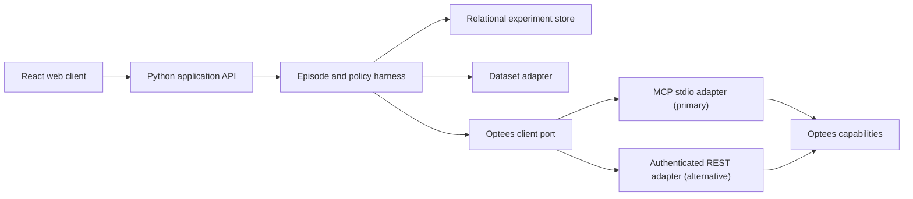

# Optees Decision Simulator

Optees Decision Simulator is a local-first experimental environment for
comparing repeatable decision policies over time. Each policy receives the same
information at the same moment, controls an isolated virtual account, and is
evaluated against later observations under frozen rules.

The first dataset adapter may use public market time series because they are
abundant, continuously updated, and difficult enough to stress forecasting and
decision workflows. The simulator is not a trading product, does not execute
real transactions, and does not provide financial advice.

## Why A Separate Repository?

[Optees](https://github.com/Pablo-gitub/optees) owns versioned mathematical
capabilities, validation, artifacts, and reports. This repository owns the
experiment around those capabilities:

- deterministic time and observation delivery;
- virtual resources and transition costs;
- policy isolation and execution;
- persistence, replay, scoring, and comparison;
- a web interface for configuring and inspecting episodes.

Keeping those responsibilities separate preserves the stateless, reusable
Optees solver core and makes the simulator replaceable by other applications.

## Planned Architecture

The browser never talks directly to Optees. The Python backend owns process
lifecycle, contract versions, validation receipts, persistence, and redaction.

## Repository Status

This repository currently contains design documentation only. No simulator,
financial connector, or decision policy has been implemented yet.

Start with:

- [Product specification](docs/PRODUCT_SPEC.md)
- [Delivery roadmap](docs/ROADMAP.md)
- [First detailed work unit: core contracts and time semantics](docs/roadmaps/core-contracts-and-time-semantics.md)
- [Architecture](docs/ARCHITECTURE.md)
- [Benchmark protocol](docs/BENCHMARK_PROTOCOL.md)
- [Optees integration](docs/OPTEES_INTEGRATION.md)

## Proposed Stack

- Python 3.12 backend
- FastAPI application API
- SQLite for local experiment state
- MCP stdio as the primary Optees transport
- authenticated loopback REST as an interchangeable fallback
- React, TypeScript, and Vite frontend

The stack remains provisional until Phase 0 contracts and threat models are
reviewed.

## Safety Boundary

The MVP is paper-only:

- no brokerage credentials;
- no order placement;
- no unattended financial actions;
- no claims that a policy is profitable outside a measured episode;
- no hidden tuning on evaluation data.

Results are educational benchmark evidence, not operational recommendations.
