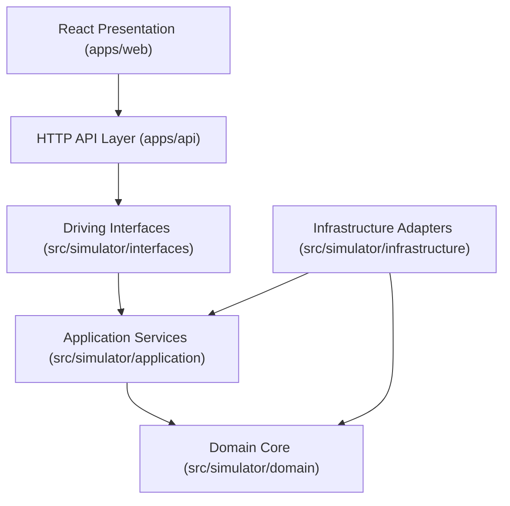

# Architecture

## Document Status

- **Status:** Active Reference
- **Work Unit:** `DS-00`
- **Gate:** `DS-C`
- **Related Documents:**
  - [Core Contracts](contracts/core-contracts.md)
  - [Threat Model](contracts/threat-model.md)
  - [Schema Inventory](contracts/schemas/schema_inventory.json)
  - [Delivery Roadmap](ROADMAP.md)

---

## 1. Repository Status: Implemented vs. Planned Structure

To maintain architectural clarity, the repository explicitly distinguishes between what is currently implemented at Gate `DS-C` and what is planned for subsequent delivery phases.

### Currently Implemented (Gate `DS-C`)
- **Documentation & Specifications:** `docs/contracts/` containing canonical contracts, temporal semantics, replay taxonomy, and threat model.
- **Contract Schemas:** `docs/contracts/schemas/` containing 15 versioned JSON Schema Draft 2020-12 specifications and `schema_inventory.json`.
- **Validation Fixtures:** `docs/contracts/examples/` containing valid and invalid canonical JSON fixtures.
- **Contract Verification Tooling:** `tools/validate_contracts.py` verifying the
  schema subset used by the v1 contracts, representative RFC 8785 golden
  vectors, SHA-256 hash properties, cutoff filtering, semantic invalid fixtures,
  and secret absence.

### Planned Structure (Phases `DS-01` through `DS-09`)
The modular codebase structure planned for subsequent phases:

```text
optees-decision-simulator/
├── apps/
│   ├── api/                  # Planned (DS-03): FastAPI composition root & loopback transport
│   └── web/                  # Planned (DS-09): React + TypeScript + Vite web interface
├── src/
│   └── simulator/            # Planned (DS-01+): Python application package
│       ├── domain/           # Planned (DS-01): Pure domain model, accounting, canonicalization
│       ├── application/      # Planned (DS-01): Harness services & port definitions
│       ├── infrastructure/   # Planned (DS-02, DS-03): SQLite, datasets, Optees MCP/REST adapters
│       └── interfaces/       # Planned (DS-03): CLI and API adapters
├── tests/                    # Planned (DS-01+): Unit, integration, and replay test suites
├── tools/                    # Implemented: Contract validation & verification scripts
└── docs/                     # Implemented: Architecture, roadmaps, contracts, threat model
```

---

## 2. Architectural Style and Dependency Rules

The simulator follows a clean hexagonal (ports and adapters) architecture. The dependency direction is strictly inbound:



### Dependency Inversion & Layer Boundaries

1. **Domain Layer (`src/simulator/domain/`):**
   - **Responsibility:** Pure business logic, entity definitions, virtual account state mutations, deterministic clock invariants, and RFC 8785 canonical JSON serialization / hashing.
   - **Import Rule:** **Zero external dependencies.** The domain layer must never import FastAPI, SQLite/SQLAlchemy, Pydantic, Requests, MCP SDKs, or Optees internal code.
2. **Application Layer (`src/simulator/application/`):**
   - **Responsibility:** Orchestrating simulation rounds, coordinating policies, enforcing knowledge cutoffs, evaluating proposals, triggering account transitions, running replay verification, and defining port interfaces.
   - **Import Rule:** Depends only on `domain`. Defines abstract ports (`ClockPort`, `DatasetPort`, `PersistencePort`, `OpteesClientPort`, `ExportPort`).
3. **Infrastructure Layer (`src/simulator/infrastructure/`):**
   - **Responsibility:** Implementing ports: SQLite repository, dataset snapshot loaders, file storage, `McpOpteesClient`, and `RestOpteesClient`.
   - **Import Rule:** Implements interfaces defined in `application` and converts infrastructure records into domain entities.
4. **Interfaces & Apps (`src/simulator/interfaces/`, `apps/api/`, `apps/web/`):**
   - **Responsibility:** Driving adapters (FastAPI routers, CLI commands, React frontend).
   - **Import Rule:** Thin presentation and translation layers that delegate all execution to application services.

---

## 3. Backend Responsibilities

- Episode and policy lifecycle management;
- Deterministic time progression and knowledge cutoff enforcement;
- Isolated virtual accounting and transition cost application;
- Optees capability discovery, validation, contract pinning, and execution;
- Relational persistence, Merkle state chaining, replay, and divergence analysis;
- Server-side report generation and artifact coordination;
- Process management and stdio sanitization for MCP child processes.

FastAPI is used exclusively as a thin loopback transport over application services.

---

## 4. Frontend Responsibilities

- Episode configuration and submission;
- Policy version selection and inspection;
- Round-by-round timeline and trajectory comparison;
- Rendering charts, tables, assumptions, solver diagnostics, and rejection reasons;
- Exporting reproducible experiment bundles.

The frontend must **never**:
- Spawn or manage Optees subprocesses;
- Hold or process Optees REST bearer tokens;
- Formulate authoritative solver payloads or modify constraints;
- Compute official portfolio valuations or scores;
- Filter or hide rejected decisions.

---

## 5. Persistence Strategy

SQLite is the chosen relational store for local experiment state because episodes, rounds, observations, decisions, solver calls, transitions, and metrics form structured relational histories.

### Stored Information:
- Immutable policy definitions and version records;
- Event, knowledge, execution, and effective timestamps;
- Canonical JSON payloads and SHA-256 hashes;
- Optees capability descriptors, contract versions, and validation receipts;
- Virtual account transition logs and state hashes;
- Artifact references and divergence reports.

Large dataset files and binary artifacts remain in bounded filesystem storage with metadata and hashes indexed in SQLite.

---

## 6. Optees Client Port and Transports

The simulator application layer defines a single port: `OpteesClientPort`.

```
                    ┌─────────────────────────┐
                    │    OpteesClientPort     │
                    └────────────▲────────────┘
                                 │
         ┌───────────────────────┼───────────────────────┐
         │                       │                       │
┌────────┴────────┐     ┌────────┴────────┐     ┌────────┴────────┐
│  McpOpteesClient│     │ RestOpteesClient│     │ FakeOpteesClient│
│ (Primary Stdio) │     │(Loopback REST)  │     │ (Unit Testing)  │
└─────────────────┘     └─────────────────┘     └─────────────────┘
```

1. **`McpOpteesClient` (Primary):** Communicates with `optees-mcp` over child process `stdio`. Preferred because it requires no listening network port, needs no authentication tokens, and allows the backend to own process lifecycle directly.
2. **`RestOpteesClient` (Alternative):** Communicates with an authenticated loopback REST daemon. Used for integration debugging and parity testing.
3. **`FakeOpteesClient` (Testing):** In-memory mock returning deterministic fixtures for offline unit and integration tests.

Both production clients return identical simulator-owned data structures (`OpteesCallReceipt`) and normalize transport errors into standard categories.

---

## 7. Determinism, Replay, and Audit Trail

Every discrete round records:
- Eligible observations at knowledge cutoff $T_k$;
- Canonical virtual account state prior to decision;
- Pinned policy and adapter versions;
- Request and response SHA-256 hashes for all Optees solver calls;
- Proposed decision and explicit acceptance/rejection outcome;
- Applied transition, fees, and resulting account state.

Replay compares cryptographic state hashes and produces structured `DivergenceReport` records instead of mutating historical logs.
