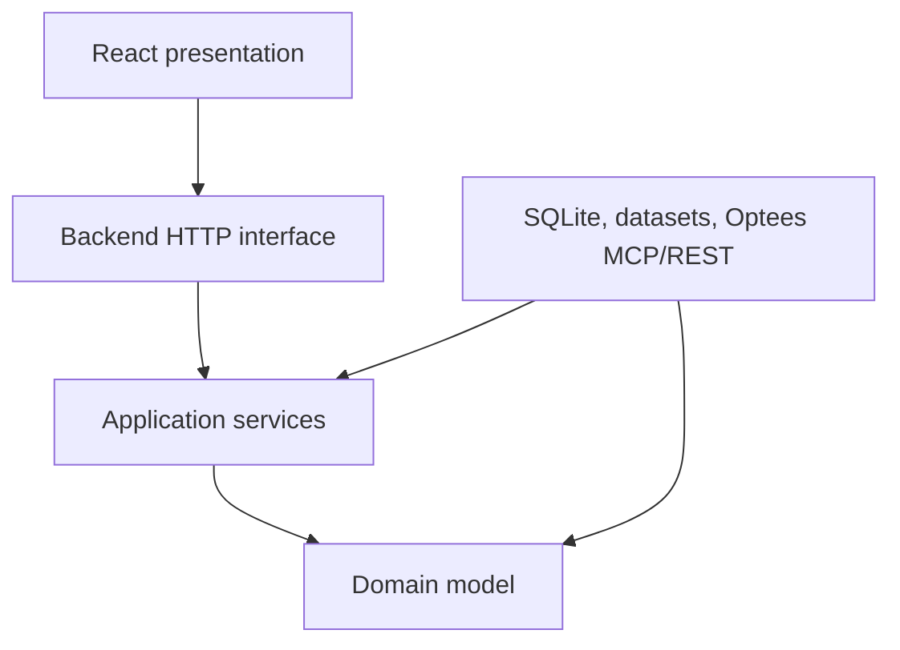

# Architecture

## Architectural Style

Use a modular monorepo with a Python backend and a React web frontend:

```text
optees-decision-simulator/
├── apps/
│   ├── api/          # Python composition root and HTTP transport
│   └── web/          # React + TypeScript + Vite
├── src/
│   └── simulator/
│       ├── domain/
│       ├── application/
│       ├── infrastructure/
│       └── interfaces/
├── tests/
└── docs/
```

The folders are planned, not created until implementation begins.

## Dependency Direction



- Domain imports no framework, transport, database, or Optees SDK.
- Application defines ports and orchestrates domain behavior.
- Infrastructure implements persistence, dataset, clock, and Optees ports.
- Interfaces translate HTTP and process events into application commands.
- The React client consumes only simulator API contracts.

## Backend Responsibilities

- episode and policy lifecycle;
- deterministic scheduling and knowledge cutoffs;
- virtual accounting;
- Optees invocation and contract pinning;
- persistence, replay, comparison, and export;
- server-side report and artifact coordination;
- safe process management for MCP.

FastAPI is suitable for the local application API, but endpoint handlers must
remain thin and delegate to application services.

## Frontend Responsibilities

- episode configuration;
- policy selection and immutable version display;
- round timeline and policy comparison;
- charts, tables, assumptions, validation, and failures;
- export requests.

The frontend must not:

- spawn Optees;
- hold Optees REST bearer tokens;
- formulate authoritative solver payloads;
- compute official scores;
- hide rejected decisions.

## Persistence

SQLite is the preferred MVP store because episodes, rounds, observations,
decisions, capability calls, and metrics are relational and must be replayable.

Store:

- immutable policy and episode versions;
- event, knowledge, execution, and effective timestamps;
- canonical JSON payloads and hashes;
- Optees capability and contract versions;
- result and independent-validation receipts;
- virtual account transitions;
- artifact identifiers and report provenance.

Large binary artifacts should remain in bounded file storage with hashes and
database metadata, not in relational blobs.

## Optees Boundary

Define one `OpteesClientPort` in the simulator application layer. Initial
implementations:

1. `McpOpteesClient`: primary local integration over stdio;
2. `RestOpteesClient`: alternative loopback integration;
3. `FakeOpteesClient`: deterministic tests.

Both production adapters must return the same simulator-owned data structures
and normalize transport errors consistently.

MCP is preferred because it:

- opens no network port;
- requires no bearer token;
- lets the backend own a child process;
- matches agent-native Optees tooling.

REST remains useful for debugging, external process ownership, and parity
tests. Transport selection must not alter policy semantics.

## Process Lifecycle

For MCP, the Python backend starts one packaged or configured `optees-mcp`
process, performs capability discovery, monitors health, and restarts only
between idempotent operations. It must never guess whether an interrupted solve
completed.

Development configuration may point to a source command. Packaged deployments
must use an explicitly configured executable path; automatic global executable
search is allowed only with a visible diagnostic.

## Security Model

- bind the simulator API to loopback by default;
- use strict request-size and episode-size limits;
- allowlist Optees tools and capability identifiers;
- reject arbitrary Python and shell execution;
- redact environment variables and tokens;
- validate dataset paths against approved roots;
- treat imported policies and episode files as untrusted;
- never allow an LLM response to become an accepted decision without contract
  validation and frozen policy rules.

## Determinism And Replay

Every official round records:

- visible observations and cutoff;
- canonical state before execution;
- policy and adapter versions;
- every Optees request and response hash;
- accepted decision and rejection reason;
- valuation input and resulting account state.

Replay compares hashes and reports divergence instead of rewriting history.
