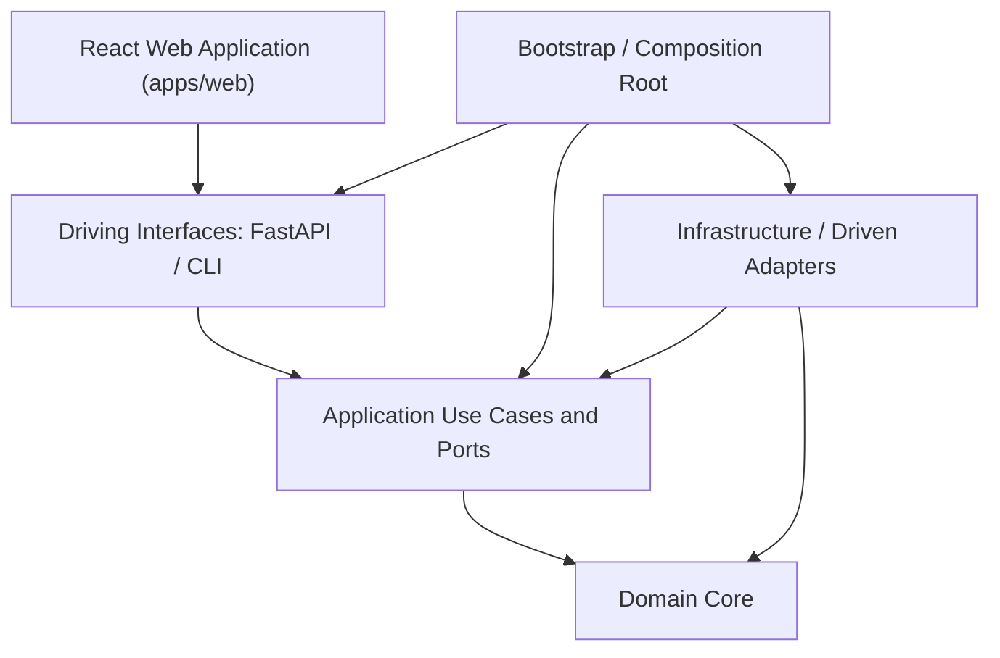

# Architecture

## Document Status

- **Status:** Active Reference
- **Work Unit:** `DS-00`
- **Gate:** `DS-C`
- **Related Documents:**
  - [Core Contracts](contracts/core-contracts.md)
  - [Threat Model](contracts/threat-model.md)
  - [Schema Inventory](contracts/schemas/schema_inventory.json)
  - [Delivery Roadmap](ROADMAP.md)

---

## 1. Repository Status: Implemented vs. Planned Structure

To maintain architectural clarity, the repository explicitly distinguishes between what is currently implemented at Gate `DS-C` and what is planned for subsequent delivery phases.

### Currently Implemented (Gate `DS-C`)
- **Documentation & Specifications:** `docs/contracts/` containing canonical contracts, temporal semantics, replay taxonomy, and threat model.
- **Contract Schemas:** `docs/contracts/schemas/` containing 15 versioned JSON Schema Draft 2020-12 specifications and `schema_inventory.json`.
- **Validation Fixtures:** `docs/contracts/examples/` containing valid and invalid canonical JSON fixtures.
- **Contract Verification Tooling:** `tools/validate_contracts.py` verifying the
  schema subset used by the v1 contracts, representative RFC 8785 golden
  vectors, SHA-256 hash properties, cutoff filtering, semantic invalid fixtures,
  and secret absence.

### Planned Structure (Phases `DS-01` through `DS-09`)
The repository is a monorepo containing two independently testable
applications. The backend is a Python modular monolith; the web application is
a React and TypeScript client. They share public contracts over the loopback
API, not source-level domain implementations.

The modular codebase structure planned for subsequent phases:

```text
optees-decision-simulator/
├── apps/
│   ├── backend/
│   │   ├── src/
│   │   │   └── simulator/    # Planned (DS-01+): Python application package
│   │   │       ├── domain/           # Pure entities, values, invariants, and services
│   │   │       ├── application/      # Use cases, ports, commands, queries, and DTOs
│   │   │       ├── infrastructure/   # Driven adapters: SQLite, files, datasets, Optees
│   │   │       ├── interfaces/       # Driving adapters: FastAPI and CLI
│   │   │       └── bootstrap/        # Configuration, dependency wiring, app factories
│   │   └── tests/             # Unit, integration, contract, and replay suites
│   └── web/
│       ├── src/
│       │   ├── domain/        # Client-side read models and display semantics
│       │   ├── application/   # UI use cases and frontend ports
│       │   ├── data/          # API clients, codecs, caches, and port implementations
│       │   └── presentation/  # React feature views and view models
│       └── tests/             # Component, accessibility, contract, and end-to-end suites
├── tools/                    # Implemented: Contract validation & verification scripts
└── docs/                     # Implemented: Architecture, roadmaps, contracts, threat model
```

Feature-oriented subpackages may be used inside each layer, but must not invert
the layer dependencies. For example, a web dashboard belongs under
`presentation/features/dashboard/` and may contain `DashboardView.tsx` and
`useDashboardViewModel.ts`; it must not create a second authoritative account
or scoring model.

---

## 2. Architectural Style and Dependency Rules

The simulator follows a clean hexagonal (ports and adapters) architecture. The dependency direction is strictly inbound:



### Dependency Inversion & Layer Boundaries

1. **Domain Layer (`apps/backend/src/simulator/domain/`):**
   - **Responsibility:** Pure entities, value objects, invariants, domain errors,
     virtual-account transitions, accounting rules, time semantics, replay
     semantics, and canonicalization/hashing rules.
   - **Import Rule:** **Zero external dependencies.** The domain layer must never import FastAPI, SQLite/SQLAlchemy, Pydantic, Requests, MCP SDKs, or Optees internal code.
2. **Application Layer (`apps/backend/src/simulator/application/`):**
   - **Responsibility:** Commands, queries, use-case services, application
     policies, boundary DTOs, and orchestration of simulation rounds, knowledge
     cutoffs, proposals, transitions, exports, and replay verification.
   - **Import Rule:** Depends only on `domain`. Defines abstract ports
     (`ClockPort`, `DatasetPort`, `PersistencePort`, `OpteesClientPort`,
     `ExportPort`) consumed by its use cases.
3. **Infrastructure Layer (`apps/backend/src/simulator/infrastructure/`):**
   - **Responsibility:** Implementing driven ports: SQLite repositories,
     dataset snapshot loaders, filesystem artifact storage, process and clock
     adapters, `McpOpteesClient`, `RestOpteesClient`, and test fakes where
     appropriate. The name `infrastructure` is intentional: this layer owns
     more than data access.
   - **Import Rule:** Implements interfaces defined in `application` and converts infrastructure records into domain entities.
4. **Interfaces Layer (`apps/backend/src/simulator/interfaces/`):**
   - **Responsibility:** Driving adapters such as FastAPI routes and CLI
     commands, including request decoding, response encoding, and error/status
     mapping.
   - **Import Rule:** Depends on `application` and public domain types only when
     necessary. It remains thin and delegates execution to application use
     cases. Backend interfaces do not use MVVM and do not own business rules.
5. **Bootstrap Layer (`apps/backend/src/simulator/bootstrap/`):**
   - **Responsibility:** Settings, dependency injection, adapter selection,
     lifecycle management, and API/CLI application factories.
   - **Import Rule:** This is the composition root and the only backend layer
     allowed to wire concrete infrastructure into interfaces and application
     ports. Other layers must not import `bootstrap`.

The effective backend direction is `interfaces -> application -> domain`;
`infrastructure` implements inward-owned ports, and `bootstrap` composes the
complete graph. The backend does not adopt frontend MVVM terminology.

---

## 3. Backend Responsibilities

- Episode and policy lifecycle management;
- Deterministic time progression and knowledge cutoff enforcement;
- Isolated virtual accounting and transition cost application;
- Optees capability discovery, validation, contract pinning, and execution;
- Relational persistence, Merkle state chaining, replay, and divergence analysis;
- Server-side report generation and artifact coordination;
- Process management and stdio sanitization for MCP child processes.

FastAPI is used exclusively as a thin loopback transport over application services.

---

## 4. Frontend Responsibilities

The web application uses MVVM inside a layered frontend:

- `domain` contains client-side read models, identifiers, value semantics, and
  display-safe invariants. It is not a TypeScript copy of the authoritative
  Python domain;
- `application` contains UI-oriented use cases and ports, such as loading an
  episode comparison or requesting an export;
- `data` implements those ports through generated or hand-maintained API
  codecs, HTTP/SSE clients, caches, and repositories;
- `presentation` contains React views and feature-local view models. Views
  render state and emit user intent; view models coordinate frontend use cases
  and expose explicit loading, empty, success, partial, and failure states.

React, TypeScript, and Vite are the selected v1 web stack. REST is the default
command/query transport and Server-Sent Events are preferred for one-way live
episode progress. WebSockets require a demonstrated bidirectional use case.

- Episode configuration and submission;
- Policy version selection and inspection;
- Round-by-round timeline and trajectory comparison;
- Rendering charts, tables, assumptions, solver diagnostics, and rejection reasons;
- Exporting reproducible experiment bundles.

The frontend must **never**:
- Spawn or manage Optees subprocesses;
- Hold or process Optees REST bearer tokens;
- Formulate authoritative solver payloads or modify constraints;
- Compute official portfolio valuations or scores;
- Filter or hide rejected decisions.

Frontend information architecture and reusable visual foundations may be
designed once the deterministic kernel and its states are stable. Functional
views should be added incrementally as backend read contracts freeze; `DS-09`
owns final integration, accessibility, responsive polish, and publication
quality rather than the first appearance of all UI code.

---

## 5. Persistence Strategy

SQLite is the chosen relational store for local experiment state because episodes, rounds, observations, decisions, solver calls, transitions, and metrics form structured relational histories.

### Stored Information:
- Immutable policy definitions and version records;
- Event, knowledge, execution, and effective timestamps;
- Canonical JSON payloads and SHA-256 hashes;
- Optees capability descriptors, contract versions, and validation receipts;
- Virtual account transition logs and state hashes;
- Artifact references and divergence reports.

Large dataset files and binary artifacts remain in bounded filesystem storage with metadata and hashes indexed in SQLite.

---

## 6. Optees Client Port and Transports

The simulator application layer defines a single port: `OpteesClientPort`.

```
                    ┌─────────────────────────┐
                    │    OpteesClientPort     │
                    └────────────▲────────────┘
                                 │
         ┌───────────────────────┼───────────────────────┐
         │                       │                       │
┌────────┴────────┐     ┌────────┴────────┐     ┌────────┴────────┐
│  McpOpteesClient│     │ RestOpteesClient│     │ FakeOpteesClient│
│ (Primary Stdio) │     │(Loopback REST)  │     │ (Unit Testing)  │
└─────────────────┘     └─────────────────┘     └─────────────────┘
```

1. **`McpOpteesClient` (Primary):** Communicates with `optees-mcp` over child process `stdio`. Preferred because it requires no listening network port, needs no authentication tokens, and allows the backend to own process lifecycle directly.
2. **`RestOpteesClient` (Alternative):** Communicates with an authenticated loopback REST daemon. Used for integration debugging and parity testing.
3. **`FakeOpteesClient` (Testing):** In-memory mock returning deterministic fixtures for offline unit and integration tests.

Both production clients return identical simulator-owned data structures (`OpteesCallReceipt`) and normalize transport errors into standard categories.

---

## 7. Determinism, Replay, and Audit Trail

Every discrete round records:
- Eligible observations at knowledge cutoff $T_k$;
- Canonical virtual account state prior to decision;
- Pinned policy and adapter versions;
- Request and response SHA-256 hashes for all Optees solver calls;
- Proposed decision and explicit acceptance/rejection outcome;
- Applied transition, fees, and resulting account state.

Replay compares cryptographic state hashes and produces structured `DivergenceReport` records instead of mutating historical logs.
