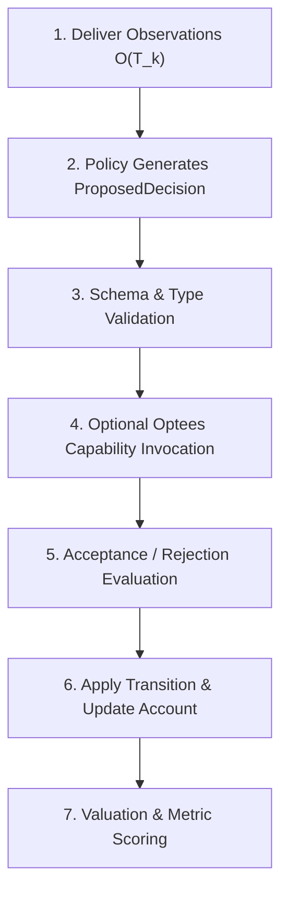
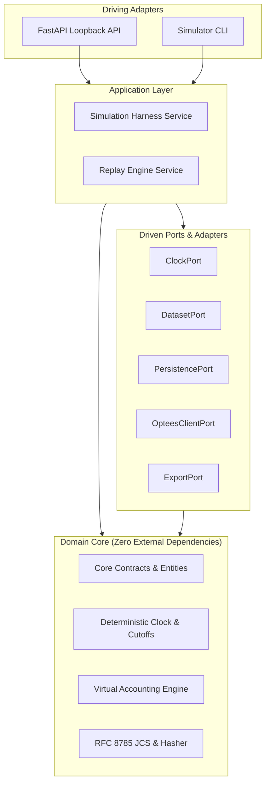

# Simulator Core Contracts and Time Semantics (v1)

## Document Status

- **Status:** Frozen (Version 1.0.0)
- **Work Unit:** `DS-00`
- **Gate:** `DS-C`
- **Authority:** Authoritative contract specification for `optees-decision-simulator`
- **Related Documents:**
  - [Architecture Reference](../ARCHITECTURE.md)
  - [Threat Model](threat-model.md)
  - [Schema Inventory](schemas/schema_inventory.json)
  - [Benchmark Protocol](../BENCHMARK_PROTOCOL.md)
  - [Optees Integration](../OPTEES_INTEGRATION.md)

---

## 1. Executive Summary and Domain Neutrality

The Optees Decision Simulator is an experimental framework for evaluating, comparing, and replaying automated decision policies over time. The primary case study leverages historical market time series to stress forecasting, optimization, and resource allocation workflows.

However, **the core contracts defined in this specification are strictly domain-neutral**. The kernel does not contain hardcoded concepts of order books, bid/ask spreads, stock tickers, or financial instruments. Instead, it operates on generic abstractions:

1. **Resources:** Generic identifiable assets/quantities (`resource_id`, `quantity`, `valuation_price`).
2. **Observations:** Versioned time-series measurements associated with event and knowledge timestamps.
3. **Decisions:** Structured allocations and generic transition actions (`ALLOCATE`, `TRANSFER`, `HOLD`, `ADJUST`).
4. **Virtual Accounts:** Isolated resource holdings with explicit transition costs and balance constraints.
5. **Optees Capabilities:** Stateless mathematical problem formulations and result receipts.

Domain-specific semantics (e.g., market trading, inventory routing, energy dispatch) are implemented via modular dataset adapters, valuation functions, and policy implementations that compile domain problems into these neutral contracts.

---

## 2. Core Entities and Schema Inventory

### 2.1 Entity Identifiers

All core entities use immutable, globally unique string identifiers with fixed prefixes:

| Entity Prefix | Entity Name | Description | Example |
|---|---|---|---|
| `ep-def_` | `EpisodeDefinition` | Frozen specification of an experiment | `ep-def_synthetic_two_policy` |
| `ep-run_` | `EpisodeRun` | Stateful execution record of an episode | `ep-run_20260801_001` |
| `pol-def_` | `PolicyDefinition` | Identity of a decision policy family | `pol-def_reactive_baseline` |
| `pol-ver_` | `PolicyVersion` | Frozen specification of a policy version | `pol-ver_reactive_v1` |
| `ds-snap_` | `DatasetSnapshot` | Manifest of a frozen input dataset | `ds-snap_synthetic_daily_v1` |
| `obs_` | `ObservationRecord` | Single observation data point | `obs_alpha_20260801` |
| `rnd_` | `RoundRecord` | Execution record of a single discrete round | `rnd_round_0` |
| `dec-prop_` | `ProposedDecision` | Action proposal emitted by a policy | `dec-prop_round0_reactive` |
| `dec-out_` | `DecisionOutcome` | Validation and acceptance record | `dec-out_round0_reactive` |
| `trn_` | `TransitionRecord` | Applied resource deltas and costs | `trn_round0_reactive` |
| `acc-state_` | `VirtualAccountState` | Snapshot of policy resources at round end | `acc-state_round0_reactive` |
| `met_` | `MetricRecord` | Explanatory metrics record | `met_round0_reactive` |
| `rcp-opt_` | `OpteesCallReceipt` | Verified solver receipt | `rcp-opt_forecast_round0` |
| `rep-rep_` | `ReplayReport` | Summary replay fidelity report | `rep-rep_replay_001` |
| `div_` | `DivergenceReport` | Detailed divergence record | `div_round1_numerical_diff` |

### 2.2 Schema Inventory

The v1 contracts are formally specified using JSON Schema Draft 2020-12 located in [`docs/contracts/schemas/`](schemas/):

1. [`episode_definition.v1.json`](schemas/episode_definition.v1.json)
2. [`episode_run.v1.json`](schemas/episode_run.v1.json)
3. [`policy_definition.v1.json`](schemas/policy_definition.v1.json)
4. [`policy_version.v1.json`](schemas/policy_version.v1.json)
5. [`dataset_snapshot.v1.json`](schemas/dataset_snapshot.v1.json)
6. [`observation.v1.json`](schemas/observation.v1.json)
7. [`round.v1.json`](schemas/round.v1.json)
8. [`proposed_decision.v1.json`](schemas/proposed_decision.v1.json)
9. [`decision_outcome.v1.json`](schemas/decision_outcome.v1.json)
10. [`transition.v1.json`](schemas/transition.v1.json)
11. [`virtual_account_state.v1.json`](schemas/virtual_account_state.v1.json)
12. [`metric_record.v1.json`](schemas/metric_record.v1.json)
13. [`optees_call_receipt.v1.json`](schemas/optees_call_receipt.v1.json)
14. [`replay_report.v1.json`](schemas/replay_report.v1.json)
15. [`divergence_report.v1.json`](schemas/divergence_report.v1.json)

### 2.3 Record Immutability and Episode Freeze

1. **Episode Start Freeze:** When an episode transitions from `CONFIGURED` to `RUNNING`, its entire context is frozen:
   - Dataset snapshot manifest, URI, and SHA-256 checksum;
   - Decision calendar and knowledge cutoff sequence;
   - Pinned policy versions, hyperparameters, and code provenance hashes;
   - Initial virtual account allocations;
   - Reference valuation rules, transaction cost models, and failure policies.
2. **Append-Only History:** All rounds, proposed decisions, decision outcomes, transitions, virtual account snapshots, metrics, receipts, and replay reports are strictly immutable. Once created and hashed, records are never updated or deleted.
3. **Episode Run Lifecycle:** The `EpisodeRun` record tracks high-level execution status through explicit state transitions:
   $$\text{CONFIGURED} \longrightarrow \text{RUNNING} \longleftrightarrow \text{PAUSED} \longrightarrow \{\text{COMPLETED}, \text{FAILED}, \text{CANCELLED}\}$$
   No state transition may alter previously recorded round hashes.

---

## 3. Temporal Semantics (The Four Times)

To guarantee scientific reproducibility and prevent temporal data leakage, the simulator formalizes four distinct timestamps for every piece of information and computation.

```
       Event Occurs                 Observation Published           Policy Runs & Proposes         Decision Takes Effect
             │                                │                                │                             │
  ───────────┼────────────────────────────────┼────────────────────────────────┼─────────────────────────────┼──────────►
             ▼                                ▼                                ▼                             ▼
        Event Time                      Knowledge Time                   Execution Time                Effective Time
        (t_event)                       (t_knowledge)                       (t_exec)                    (t_effective)
   [Domain Fact Genesis]          [Permitted Policy Horizon]           [Wall-clock Compute]         [Account State Mutation]
```

### 3.1 Formal Definitions

1. **Event Time ($t_{event}$):**
   The timestamp when the represented physical or domain phenomenon occurred (e.g., market close, sensor measurement, trade tick).
2. **Knowledge Time ($t_{knowledge}$):**
   The timestamp when the measurement became publicly available, published, and eligible to be observed by policies. In real-world data pipelines, $t_{knowledge} \ge t_{event}$ due to publication latency, batching, or reporting lags.
3. **Execution Time ($t_{exec}$):**
   The physical wall-clock timestamp when the simulator harness and policy code executed the computation.
4. **Effective Time ($t_{effective}$):**
   The simulation timestamp at which an accepted decision is executed, mutating the virtual account state and incurring transition fees.

### 3.2 Timezone Normalization, Precision, and Formats

- **Timezone:** All timestamps **MUST** be normalized to UTC and serialized in strict RFC 3339 / ISO 8601 format with an uppercase `Z` suffix:
  $$\text{YYYY-MM-DDTHH:MM:SSZ} \quad \text{or} \quad \text{YYYY-MM-DDTHH:MM:SS.sssZ}$$
- **Rejection of Ambiguity:** Local offset strings (e.g. `+02:00`, `-05:00`) and naive datetimes without timezone identifiers are strictly invalid and rejected during schema validation.
- **Precision:** Sub-second fractions are optional but must use standard decimal seconds with millisecond or microsecond resolution where present.

### 3.3 Knowledge Cutoff and Anti-Leakage Invariant

Each round $r$ defines an exact **Knowledge Cutoff** timestamp $T_k(r)$.

#### The Formal Anti-Leakage Rule:
$$\forall \text{ observation } o \text{ delivered to or consumed by policy } P \text{ in round } r: \quad t_{knowledge}(o) \le T_k(r)$$

An observation $o$ is eligible for round $r$ if and only if its knowledge timestamp does not exceed $T_k(r)$. If a policy queries or uses an observation where $t_{knowledge}(o) > T_k(r)$, the harness raises an unrecoverable `TemporalLeakageError` and fails the episode.

### 3.4 Interval Boundaries and Tie-Breaking

- **Observation Windows:** When a policy requests a lookback window of duration $\Delta t$, the eligible observation set covers the closed knowledge interval:
  $$I_{knowledge} = [T_k(r) - \Delta t, \; T_k(r)]$$
- **Deterministic Ordering and Tie-Breaking:** When multiple observations share the same knowledge timestamp, they are sorted deterministically by the tuple:
  $$(t_{knowledge}, \; t_{event}, \; \text{series\_id}, \; \text{revision}, \; \text{observation\_id})$$

### 3.5 Late Observations and Revisions

Real-world datasets contain delayed observations and retroactive revisions (e.g., macroeconomic adjustments, restated reports). The simulator represents these non-destructively:
- An initial observation is recorded with $t_{event} = T_1, \; t_{knowledge} = T_1 + \delta_1, \; \text{revision} = 1$.
- A revised observation is recorded as a distinct, immutable record with $t_{event} = T_1, \; t_{knowledge} = T_2, \; \text{revision} = 2$, where $T_2 > T_1 + \delta_1$.
- For rounds with cutoff $T_k < T_2$, only revision 1 is visible.
- For rounds with cutoff $T_k \ge T_2$, revision 2 is visible and supersedes revision 1 according to dataset adapter rules. Past round logs are never rewritten.

---

## 4. Policy Isolation and Observation Delivery

### 4.1 Observation Equality
In every round $r$, all competing policies are provided with an identical set of eligible observations:
$$\mathcal{O}_{eligible}(r) = \{ o \in \text{DatasetSnapshot} \mid t_{knowledge}(o) \le T_k(r) \}$$
No policy may receive privileged private feeds, dynamic lookahead, or policy-specific data cleansing within the core kernel.

### 4.2 Account Isolation
Each policy $P_i$ controls exactly one isolated virtual account $A_i$.
- Policy $P_i$ cannot inspect the account balance, history, or pending decisions of any other policy $P_j$ ($j \ne i$).
- Cross-policy transfers or resource referencing (e.g., policy A attempting to debit policy B's account) are hard structural violations rejected by schema validation and the accounting engine.

---

## 5. Decision and Transition Lifecycle Boundary

To prevent accidental coupling between policy computation, solver availability, and accounting state, every round follows a strict 7-stage decoupled lifecycle:



1. **Observation Delivery:** Simulator extracts $\mathcal{O}_{eligible}(r)$ at cutoff $T_k(r)$ and provides it to the policy.
2. **Policy Proposal:** Policy emits a `ProposedDecision` specifying target allocations or requested transition actions.
3. **Schema Validation:** The simulator verifies that the proposed decision matches `proposed_decision.v1.json`, contains valid resource IDs, and uses finite numbers.
4. **Optees Invocation (Optional):** If the policy uses Optees solvers or forecasting, it communicates through the `OpteesClientPort`. The exact problem, result, validation receipt, and timing are recorded in an `OpteesCallReceipt`.
5. **Acceptance / Rejection:** The simulator evaluates the proposal against the frozen `EpisodeDefinition` rules (balance constraints, borrowing permissions, transaction limits). It produces an immutable `DecisionOutcome` (`ACCEPTED`, `REJECTED`, or `FALLBACK_HOLD`).
6. **Account Transition:** If accepted, a `TransitionRecord` applies resource deltas at $t_{effective}$, deducts transaction costs, and creates a new immutable `VirtualAccountState`.
7. **Valuation & Metrics:** At the evaluation cutoff, reference valuation prices are applied to compute total portfolio value ($V_t$) and explanatory metrics (`MetricRecord`).

> [!IMPORTANT]
> **Transport & Solver Independence:** A successful Optees solver status or successful network transport does **NOT** constitute decision acceptance. The simulator alone determines decision feasibility against account rules.

---

## 6. JSON Canonicalization and Reproducible Hashing

### 6.1 Standard Selection: RFC 8785 (JSON Canonicalization Scheme - JCS)

To ensure bit-for-bit cryptographic reproducibility across heterogeneous runtimes (Python backend, JavaScript/TypeScript frontend, CLI tools, external verifiers), the simulator adopts **IETF RFC 8785 (JSON Canonicalization Scheme)**.

#### Justification for RFC 8785:
- It is an open, formal international standard with proven reference implementations in Python (`canonicaljson`, `jcs`) and JavaScript/TypeScript (`canonicalize`).
- It completely eliminates serialization ambiguity without requiring custom ad-hoc sorting or delimiter rules.

### 6.2 Canonicalization Rules

1. **UTF-8 Encoding:** All canonical payloads are serialized as raw UTF-8 bytes without Byte Order Mark (BOM).
2. **Key Ordering:** Object keys are sorted lexicographically by UTF-16 code unit values.
3. **Whitespace:** Zero insignificant whitespace (no spaces after colons or commas).
4. **String Normalization:** All Unicode string values are normalized to **Unicode Normalization Form C (NFC)** prior to serialization.
5. **Escape Sequences:** Only required characters are escaped (`\"`, `\\`, and control characters `\u0000` through `\u001F`). Forward slashes (`/`) are **never** escaped.
6. **Number Representation:**
   - Numbers are formatted per ECMAScript `ToString(Number)` specification (IEEE 754 double precision float).
   - Negative zero (`-0.0`) is normalized to `0`.
   - Non-finite numbers (`NaN`, `Infinity`, `-Infinity`) are strictly forbidden and rejected.
7. **Exact Quantities & Currency:** For high-precision financial or accounting balances where floating-point rounding is hazardous, values **MUST** be encoded as canonical decimal strings (e.g., `"10000.00"`, `"-2003.00"`).

### 6.3 Hashing Specification

- **Algorithm:** SHA-256 (FIPS 180-4).
- **Format:** Lowercase hexadecimal string prefixed with `sha256:`, e.g.:
  `sha256:e3b0c44298fc1c149afbf4c8996fb92427ae41e4649b934ca495991b7852b855`
- **Hash Coverage:** The hash is computed over the UTF-8 bytes of the RFC 8785 canonical JSON representation of the entire object, including `$type`, `schema_version`, and all payload fields.
- **Merkle Chaining:**
  - Every `RoundRecord` contains `parent_round_hash`.
  - Every `VirtualAccountState` contains `parent_state_hash`.
  - The final state hash of an episode run forms a cryptographic proof of the entire historical execution trajectory.
- **Redaction Policy:** Authorization tokens, passwords, raw environment variables, and local OS paths are strictly redacted prior to serialization and hashing.

---

## 7. Replay Semantics and Divergence Taxonomy

The simulator distinguishes four distinct replay modes to verify correctness across environments and solver versions without modifying historical records.

```
┌─────────────────────────────────────────────────────────────────────────────┐
│                              REPLAY MODES                                   │
├──────────────────────────┬──────────────────────────────────────────────────┤
│ 1. Record Replay         │ Rebuild state purely from stored accepted logs   │
│ 2. Deterministic Rerun   │ Re-execute policy code; assert exact hash match  │
│ 3. Numerical Rerun       │ Re-run solvers; verify within tolerance epsilon  │
│ 4. Incompatible Replay   │ Required solver/dataset unavailable              │
└──────────────────────────┴──────────────────────────────────────────────────┘
```

### 7.1 Replay Modes

1. **Record Replay (`RECORD_REPLAY`):**
   Reconstructs the virtual account trajectory and metrics directly from retained `ProposedDecision`, `DecisionOutcome`, and `TransitionRecord` entries. It does not invoke policy code or Optees solvers. Verifies database consistency and accounting logic.
2. **Deterministic Re-Execution (`DETERMINISTIC_RE_EXECUTION`):**
   Re-executes deterministic policies against the frozen `DatasetSnapshot`. Asserts that all proposed decisions, outcomes, and transitions match the original SHA-256 record hashes bit-for-bit.
3. **Numerical Re-Execution (`NUMERICAL_RE_EXECUTION`):**
   Re-executes policies that depend on numerical solvers (e.g., Optees QP, LP, MILP) or stochastic algorithms. Compares results against the original run and verifies that deviations remain within declared numerical tolerances ($\epsilon$).
4. **Incompatible Replay (`INCOMPATIBLE_REPLAY`):**
   Triggered when an environment cannot perform re-execution due to missing dependencies, unpinned solver versions, or unavailable hardware. Emits an explanatory audit record.

### 7.2 Divergence Taxonomy

When re-execution differences occur, the simulator never overwrites original history. Instead, it generates an immutable `DivergenceReport` categorized into one of seven frozen categories:

| Divergence Category | Description | Permitted Action |
|---|---|---|
| `EXACT_MATCH` | Hash match with 0.0 delta | Validated replay |
| `NUMERICAL_EPSILON_DEVIATION` | Output difference $\le \epsilon_{declared}$ | Accepted as numerically equivalent |
| `NUMERICAL_TOLERANCE_EXCEEDED` | Solver output difference $> \epsilon_{declared}$ | Flagged as numerical regression |
| `DECISION_DIVERGENCE` | Policy produced a structurally different proposal | Flagged as non-deterministic logic |
| `VALIDATION_STATUS_CHANGE` | Problem feasibility or validation status changed | Flagged as solver contract change |
| `TIMEOUT_OR_TERMINAL_FAILURE` | Solver timed out or threw an execution exception | Flagged as runtime failure |
| `ENVIRONMENT_INCOMPATIBILITY` | Missing capability, contract version, or runtime | Flagged as incompatible environment |

---

## 8. Application Ports and Dependency Architecture

The simulator follows clean hexagonal architecture. The domain core has zero dependencies on external frameworks, databases, transports, or web technologies.



### 8.1 Core Application Ports

1. **`ClockPort`:** Manages deterministic virtual time advancement and cutoff scheduling.
2. **`DatasetPort`:** Loads frozen dataset manifests and provides cutoff-filtered observation streams $\mathcal{O}_{eligible}(T_k)$.
3. **`PersistencePort`:** Appends and retrieves immutable records, episode definitions, rounds, and divergence reports.
4. **`OpteesClientPort`:** Discovers Optees capabilities, verifies contract schemas, validates problems, submits jobs, and returns verified receipts.
5. **`ExportPort`:** Exports verifiable episode bundles and generates human-readable markdown summaries.

### 8.2 Dependency Inversion Rules

- The `domain` package **MUST NOT** import `fastapi`, `sqlite3`, `pydantic` (if using custom domain models), `requests`, `mcp`, `react`, or any Optees internal package.
- The simulator interacts with Optees strictly through versioned schema DTOs and the `OpteesClientPort`.

---

## 9. Gate DS-C Acceptance Criteria

Gate `DS-C` is satisfied when:
1. All 15 v1 schemas are formally defined, validated, and indexed in `schema_inventory.json`.
2. All mandatory valid examples pass schema validation and invariant checks.
3. All mandatory invalid examples are verified to violate explicit temporal, identity, or isolation invariants.
4. RFC 8785 canonical serialization produces byte-identical output across different dictionary key insertion orders.
5. Mutating any semantic field produces a distinct SHA-256 hash.
6. The dedicated threat model is complete and addresses all 12 required threat vectors.
7. Documentation cross-links are verified without broken references.
8. No application or kernel implementation code is introduced prematurely.
