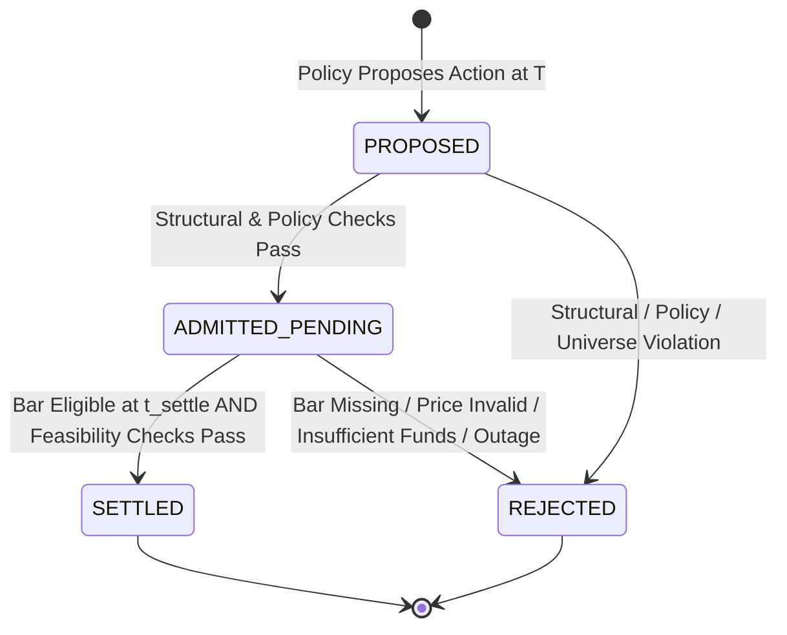

# Deferred Paper Settlement Contract (v1.1 Planned Specification)

## Document Status

- **Status:** Frozen Contract Decision (Specification for Gate `DS-D3T`)
- **Work Unit:** `DS-02D1` — Deferred Settlement Contract
- **Gate:** `DS-D3T` (Satisfied)
- **Implementation Gate:** `DS-02D2` (Planned Deferred Settlement Kernel)
- **Authority:** Authoritative contract decision for market execution and temporal causality in `optees-decision-simulator`
- **Related Documents:**
  - [Core Contracts (v1)](core-contracts.md)
  - [Market Dataset Provenance (v1)](market-dataset-provenance.md)
  - [Threat Model](threat-model.md)
  - [Architecture Reference](../ARCHITECTURE.md)
  - [Market Dataset Roadmap](../roadmaps/market-dataset-and-baseline-evidence.md)

---

## 1. Context and Problem Statement

The review of Phase `DS-02D` identified a fundamental temporal incompatibility between the synchronous v1 episode kernel and realistic market data availability:

1. **Event Time Semantics in Observations:** In the v1 dataset normalizer (`simulator.infrastructure.adapters.market_normalizer`), `ObservationRecord.event_time` is set to the upstream bar's `close_time` (e.g., `2026-08-01T23:59:59.999Z`). The `payload` retains the `open` price, but does not store the upstream `open_time`.
2. **Knowledge Cutoff Anti-Leakage:** A policy deciding at round cutoff $T$ may only consume observations with $t_{\text{knowledge}} \le T$.
3. **Execution Price Independence:** An execution fill must occur *after* the decision cutoff $T$ and cannot trade at the day-$D$ close price that was already known and used to value holdings at $T$.
4. **Historical Archive Publication Lag ($D+2$):** Under the conservative historical availability rule frozen in `market-dataset-provenance.md`, the complete daily archive containing the bar of day $D$ is published at $t_{\text{knowledge}} = (D + 2\text{d})\text{T}00:00:00\text{Z}$.
5. **Kernel Synchrony Limitation:** The v1 `EpisodeRunner` set `effective_time = cutoff`, requiring proposals to be evaluated, executed, and settled synchronously within the same cutoff instant. Because an observation for a future bar ($t_{\text{event}} > T$) has $t_{\text{knowledge}} \ge T + 2\text{d}$, the condition $t_{\text{knowledge}} \le \text{effective\_time}$ can never hold when $\text{effective\_time} = T$.

This document formalizes the **Deferred Paper Settlement** contract to resolve this review blocker without relaxing conservative anti-leakage or backdating records.

---

## 2. Temporal Model: The Five Distinct Times

The simulator expands its temporal model for market execution into five distinct, strictly ordered timestamps:

```text
       Decision Cutoff (T)           Economic Fill (t_fill)        Observation Available (t_knowledge)       Account Settled (t_settle)
  Policy Context Frozen         Order Fills at Open Price        Complete Bar Ingested              Balances & Costs Mutated
            │                               │                                    │                                    │
 ───────────┼───────────────────────────────┼────────────────────────────────────┼────────────────────────────────────┼────────►
            ▼                               ▼                                    ▼                                    ▼
       T_cutoff                        t_fill                              t_knowledge                           t_settle
   [Horizon Frozen]             [Market Open Event]                     [D+2 Publication]                  [Accounting Transition]
```

### 2.1 Formal Definitions

1. **Decision Cutoff ($T_{\text{cutoff}}$):**
   The discrete calendar boundary for round $r$. It bounds the policy's observation horizon:
   $$\mathcal{O}_{\text{eligible}}(r) = \{ o \in \text{DatasetSnapshot} \mid t_{\text{knowledge}}(o) \le T_{\text{cutoff}} \}$$
2. **Proposal Generated Time ($t_{\text{prop}}$):**
   The timestamp recorded when the policy emits `ProposedDecision`. By invariant, $t_{\text{prop}} = T_{\text{cutoff}}$.
3. **Economic Fill Time ($t_{\text{fill}}$):**
   The domain timestamp at which the trade execution is economically priced. In daily market trading, this is the opening instant of the execution bar:
   $$t_{\text{fill}} = \text{open\_time}(\text{bar}_{\text{exec}})$$
   where $\text{bar}_{\text{exec}}$ is the earliest daily bar satisfying $\text{open\_time} \ge T_{\text{cutoff}}$.
4. **Observation Knowledge Time ($t_{\text{knowledge}}$):**
   The simulation timestamp when the complete observation record for $\text{bar}_{\text{exec}}$ is published and available to the simulation clock. Under the conservative historical $D+2$ rule for a bar on date $D_{\text{exec}}$:
   $$t_{\text{knowledge}}(\text{bar}_{\text{exec}}) = (D_{\text{exec}} + 2\text{d})\text{T}00:00:00\text{Z}$$
   Prior to this timestamp, the open price $P_{\text{open}}(\text{bar}_{\text{exec}})$ is physically unknown to the simulator.
5. **Account Settlement Time ($t_{\text{settle}}$):**
   The simulation timestamp when the pending transition is processed: the execution price is retrieved from the newly eligible observation, financial feasibility is verified, transaction costs are calculated, balance mutations are applied, and a new `VirtualAccountState` is minted.
   Because the observation is unavailable before $t_{\text{knowledge}}$, settlement cannot occur prior to $t_{\text{knowledge}}$:
   $$t_{\text{settle}} \ge t_{\text{knowledge}}(\text{bar}_{\text{exec}}) > t_{\text{fill}} \ge T_{\text{cutoff}}$$

### 2.2 Strict Causal Invariant

Every market transition governed by deferred settlement must satisfy:
$$T_{\text{cutoff}} = t_{\text{prop}} \le t_{\text{fill}} < t_{\text{knowledge}}(\text{bar}_{\text{exec}}) \le t_{\text{settle}}$$

Under a standard daily calendar where round cutoffs occur at `00:00:00Z`:
- If a decision is proposed at Round $r$ cutoff $T_r = \text{2026-08-01T00:00:00Z}$:
  - The target execution bar is Day $D = \text{2026-08-01}$.
  - $t_{\text{fill}} = \text{open\_time} = \text{2026-08-01T00:00:00.000Z}$.
  - $t_{\text{knowledge}} = \text{2026-08-03T00:00:00Z}$ (Round $r+2$ cutoff).
  - $t_{\text{settle}} = \text{2026-08-03T00:00:00Z}$.

---

## 3. Preservation of `open_time` in Observations

### 3.1 Normalizer Contract Update (Implemented in DS-02D2A)

The current normalizer profile is `binance_kline_spot_1d`, version `1.1.0`:
1. `open_time` from the upstream Binance CSV must be formatted as an explicit ISO 8601 UTC string with uppercase `Z`.
2. Sub-second precision must be retained exactly:
   - Millisecond precision (`.sssZ`) for pre-2025 records;
   - Microsecond precision (`.ssssssZ`) for 2025+ records.
3. The normalized `open_time` string is placed inside `ObservationRecord.payload["open_time"]`.
4. `ObservationRecord.event_time` continues to store the bar `close_time`, preserving the semantics of `event_time` as the bar completion boundary.

### 3.2 Backward Compatibility

New acquisition receipts declare normalizer version `1.1.0`. If refetch finds
the same raw artifact under a snapshot with a different normalizer identity or
version, acquisition fails and requires a new snapshot ID. It neither returns
legacy normalization as current nor overwrites historical evidence. Legacy
packages remain readable through the offline adapter. Snapshot names are
caller-provided; use a version suffix such as `_v1_1` (dots are not permitted).

The existing v1 schema `observation.v1.json` specifies `"payload": {"type": "object", "additionalProperties": true}`. Therefore, adding `"open_time"` to `payload` is valid under `observation.v1.json` without requiring a breaking schema change. However, because altering the payload affects canonical JSON and snapshot hashes, new market datasets containing `"open_time"` should use snapshot IDs denoting version `v1.1` (e.g. `ds-snap_binance_spot_1d_v1_1`). Existing v1 fixtures remain immutable.

---

## 4. Pending Transition Lifecycle and Status Semantics

Pending quantities are finite Decimals. `TRANSFER` is signed: positive adds
units and negative removes units, matching the existing execution contract.
Other action kinds retain the non-negative record constraint. This structural
permission does not grant borrowing or short selling: holdings, cash, costs and
supported action semantics must be checked by the planned settlement service.
No deferred execution service is implemented by this contract correction.

To avoid overloading `DecisionStatus.ACCEPTED` with ambiguous meanings, the deferred settlement contract defines a clear, closed state machine:



### 4.1 Status Definitions

- **`ADMITTED_PENDING`:**
  The proposal passed structural and admission checks at round cutoff $T_{\text{cutoff}}$.
  - *Checked at Admission:* Policy ownership, configured resource universe, supported action types, finite quantities with action-specific signs (signed `TRANSFER`), transition count limits, and single-pending policy invariant.
  - *Not Checked at Admission:* Cash sufficiency, borrowing limits, short-position constraints, and transaction fee deductions. These checks cannot be performed at admission because $P_{\text{open}}$ is not yet known.
  - *Account Impact:* Zero balance mutation. The account remains in its previous state with unchanged balances.
- **`SETTLED`:**
  Terminal success. At simulation time $t_{\text{settle}} \ge t_{\text{knowledge}}$, the execution observation is available.
  - The fill price $P_{\text{open}}$ is extracted.
  - Financial feasibility is verified against the actual execution price.
  - Resource deltas are applied, transaction fees are deducted, and a new `VirtualAccountState` is minted.
  - A `TransitionRecord` is created recording $t_{\text{settle}}$, $t_{\text{fill}}$, resource deltas, and costs.
- **`REJECTED`:**
  Terminal rejection. Occurs either at admission (structural invalidity) or at settlement (financial infeasibility, missing bar, invalid price, or episode termination).
  - *Account Impact:* Zero balance mutation, zero fee deduction.
  - *Policy Impact:* Clears the pending transition state, allowing the policy to propose in subsequent rounds.

---

## 5. Timing of Feasibility and Constraint Verification

### First application service profile (planned DS-02D2B1)

The [executable admission plan](../roadmaps/deferred-admission-services.md)
freezes one explicit action per proposal: positive `ALLOCATE`, nonzero signed
`TRANSFER`, or zero-quantity `HOLD`. `ADJUST`, desired allocations and action
baskets are explicitly rejected rather than silently interpreted. The domain
schema remains broader than this first service profile. Allowed resources and
series are injected configuration; market symbols are not hardcoded in the core.
Trades in the reference resource are not supported. HOLD and immediate rejection
use `DecisionOutcome.v1`; an admitted trade produces only a pending record.
Active-pending retries compare full proposal evidence, not just decision IDs.
The B1 retry implementation also verifies the derived episode-scoped pending
identity and requires expected_open_time to remain absent. Replacing a pending
trade with HOLD under the same decision ID is a conflict, not an accepted HOLD.
This pure service does not provide persistent deduplication or settlement.

This is a planned profile, not implemented behavior. The normative rules below
continue to govern the later settlement block.

### Second application service profile (implemented and reviewed `DS-02D2B2`)

The [executable settlement plan](../roadmaps/deferred-settlement-services.md)
freezes deterministic, non-skipping target-bar selection over the retained
`payload["open_time"]` field (never `event_time`), explicit `ROUND_HALF_EVEN`
Decimal rounding on every quantization, and a closed
still-pending/`SETTLED`/`REJECTED` trichotomy. Financial feasibility
(execution price validity, cash sufficiency, short-position prohibition,
missing valuation marks) is checked only at settlement, never at admission,
exactly as this contract's timing table requires. The settlement-window
timeout for `MISSING_EXECUTION_BAR`, and the exogenous
`UNSETTLED_EPISODE_TERMINATION`/`EPISODE_CANCELLED` triggers, are scheduling
decisions the plan explicitly leaves to the future runner (`DS-02D2C`); the
settlement service only knows how to record each of those terminal outcomes
correctly once instructed.

Reviewed refinements: attempt_settlement requires an explicit expected_open_time
from frozen calendar configuration, never inferred from the available bars.
Only that opening in the episode snapshot can fill. The entire calculation runs
in an isolated 64-digit Decimal context with explicit HALF_EVEN rounding and fixed
traps. On rejection total_fee_deducted is zero, not a hypothetical charge.
Episode-scoped pending identity is checked; terminal IDs derive from pending and
round identities. An optional admission_account proves the original anchor when
the current account was revalued; balances/costs must match, while the successful
transition before-hash uses the current account. The linked service plan specifies
these interfaces and the remaining caller obligations. Runner/replay is still planned.

The contract strictly divides validation responsibilities between admission and settlement:

| Constraint / Check | Verification Stage | Price Used | Action on Failure |
|---|---|---|---|
| Policy Identity & Contamination | Admission ($T_{\text{cutoff}}$) | N/A | Immediate `REJECTED` (`CROSS_POLICY_ACCOUNT_CONTAMINATION`) |
| Allowed Universe (`BTC`, `ETH`, `SOL`, `BNB`, `USDT`) | Admission ($T_{\text{cutoff}}$) | N/A | Immediate `REJECTED` (`UNSUPPORTED_RESOURCE`) |
| Action Type & Syntax | Admission ($T_{\text{cutoff}}$) | N/A | Immediate `REJECTED` (`INVALID_ACTION_SYNTAX`) |
| Single Pending Constraint | Admission ($T_{\text{cutoff}}$) | N/A | Immediate `REJECTED` (`POLICY_HAS_PENDING_SETTLEMENT`) |
| Transition Count Limit | Admission ($T_{\text{cutoff}}$) | N/A | Immediate `REJECTED` (`TRANSITION_LIMIT_EXCEEDED`) |
| Observation Availability | Settlement ($t_{\text{settle}}$) | N/A | Terminal `REJECTED` (`MISSING_EXECUTION_BAR`) |
| Positive Finite Execution Price | Settlement ($t_{\text{settle}}$) | $P_{\text{open}}$ | Terminal `REJECTED` (`INVALID_EXECUTION_PRICE`) |
| Sufficient Unallocated Cash (No Borrowing) | Settlement ($t_{\text{settle}}$) | $P_{\text{open}}$ | Terminal `REJECTED` (`INSUFFICIENT_FUNDS_AT_SETTLEMENT`) |
| Sufficient Asset Balance (No Shorting) | Settlement ($t_{\text{settle}}$) | $P_{\text{open}}$ | Terminal `REJECTED` (`SHORT_POSITIONS_FORBIDDEN`) |
| Transaction Fee Calculation | Settlement ($t_{\text{settle}}$) | $P_{\text{open}}$ | Deducted from settled cash balance |

---

## 6. Account Visibility and the Single-Pending Invariant

### 6.1 The Single-Pending Policy Invariant (v1.1)

To prevent cascading margin debt, speculative leverage, and race conditions, the v1.1 contract enforces:
$$\text{Max Pending Non-HOLD Transitions Per Policy} = 1$$

- While a policy has an active `ADMITTED_PENDING` transition, it is prohibited from submitting any new decision containing `ALLOCATE`, `TRANSFER`, or `ADJUST`.
- The policy is permitted to submit only `HOLD` (or no decision) while waiting for settlement.
- If a policy submits a non-`HOLD` action while a previous order is pending, the new proposal is immediately rejected with rejection reason:
  `POLICY_HAS_PENDING_SETTLEMENT: Policy already has a pending transition awaiting settlement`.

### 6.2 Account Balance Visibility

Between $T_{\text{cutoff}}$ and $t_{\text{settle}}$:
1. Virtual account balances (`balances`) remain completely unmutated.
2. Unsettled cash proceeds from asset sales are **NOT** available to spend.
3. Assets purchased are **NOT** available to sell or transfer until the settlement transaction mints the updated account state.
4. Valuation marks at intermediate rounds (e.g. Round $r+1$) continue to evaluate existing unsettled holdings at the latest eligible close marks available at that round's cutoff.

---

## 7. Event Ordering at Shared Timestamps

When an observation publication, a settlement event, and a subsequent round cutoff share the exact same timestamp (e.g. $T = \text{2026-08-03T00:00:00Z}$):

The simulator executes operations in strict deterministic sequence:

```text
Step 1: Clock Advances to T
Step 2: Eligibility Filtering (Observations with t_knowledge <= T become eligible)
Step 3: Pending Settlement Phase (Evaluate fill price, check feasibility, apply deltas, mint account state)
Step 4: Policy Delivery Phase (Deliver newly settled account state and eligible observations to policies)
Step 5: Policy Proposal Phase (Policy generates new proposal without pending block)
Step 6: Round Commit Phase (Atomic commit of round records and state Merkle hash)
```

**Theorem (Causal Separation):**
Because Step 3 strictly precedes Step 4 and Step 5:
- Policies never make a decision while in an indeterminate pending state.
- Settled cash and assets are immediately visible and usable in Step 5.
- Zero lookahead or race conditions can occur.

---

## 8. Failure Modes, Outages, and Edge Cases

### 8.1 Missing Future Bar or Upstream Outage
If the archive for the execution day is missing from the dataset (e.g., exchange halt or archive omission):
- At $t_{\text{knowledge}}$, the observation is not found.
- If the bar does not arrive within a defined maximum settlement window (default: 1 calendar day past expected $t_{\text{knowledge}}$), the pending order transitions to terminal `REJECTED` with reason `MISSING_EXECUTION_BAR`.
- No forward-filled synthetic bar is ever fabricated. Zero account mutation.

### 8.2 Delayed Archive Publication
If upstream publishing latency delays archive availability from $D+2$ to $D+3$:
- At $D+2$, the bar is not yet eligible ($t_{\text{knowledge}} > D+2$).
- The transition remains in `ADMITTED_PENDING`.
- At $D+3$, when the archive is ingested, settlement proceeds normally.
- The policy remains restricted to `HOLD` until settlement occurs.

### 8.3 Price Movement Causing Insufficient Funds
A policy proposes buying $1.0\text{ BTC}$ when the valuation mark is $\$60,000$, having $\$65,000$ cash.
At fill time, $P_{\text{open}}$ is $\$70,000$. Total cost with fees is $\$70,071$.
- At settlement, the condition $\text{cash} - \text{cost} \ge 0$ fails.
- The settlement engine marks the transition `REJECTED` with reason `INSUFFICIENT_FUNDS_AT_SETTLEMENT`.
- Zero BTC is credited; zero cash is deducted. The full $\$65,000$ cash balance is preserved.

### 8.4 Retroactive Upstream Revision
- **Revision Arriving Before Settlement:** If a revised kline (revision 2) is published with $t_{\text{knowledge}} \le t_{\text{settle}}$, the settlement engine uses the highest eligible revision to evaluate $P_{\text{open}}$.
- **Revision Arriving After Settlement:** In accordance with Section 3.5 of `core-contracts.md`, once an account transition is settled, committed, and hashed into an immutable `VirtualAccountState`, retroactive revisions to past market bars **NEVER** alter past account states, transitions, or round hashes. Historical trajectory remains immutable.

### 8.5 Episode Termination / Dataset Exhaustion
If an episode reaches its final round, or if the dataset ends while a transition is still `ADMITTED_PENDING`:
- The pending order cannot settle.
- At episode termination, the runner marks the pending transition `REJECTED` with reason `UNSETTLED_EPISODE_TERMINATION`.
- The final virtual account state reflects only fully settled transitions.

---

## 9. Record Immutability, Replay, and Schema Versioning

### 9.1 Schema Evolution Strategy

To maintain strict contract integrity:
1. **v1.0 Core Schemas Remain Frozen:** We do not silently rewrite `decision_outcome.v1.json` or `transition.v1.json` in place.
2. **Planned Schema Additions (for `DS-02D2`):**
   - [`decision_outcome.v1.json`](schemas/decision_outcome.v1.json) remains unchanged and
     continues to describe the synchronous v1 lifecycle only.
   - Add `pending_transition.v1.json`. One immutable admission record owns the stable
     `pending_transition_id` (`pnd_` prefix), proposal/decision identity, policy identity, requested action,
     cutoff, target-bar selection rule, admission evidence and predecessor account hash.
     Admission status is always `ADMITTED_PENDING`; it is not a mutable outcome.
   - Add `settlement_outcome.v1.json`. Exactly one immutable terminal record links the
     `pending_transition_id` and decision identity, uses the `set-out_` identifier prefix,
     and has status `SETTLED` or `REJECTED`.
     It records settlement time, selected observation/revision evidence, rejection reasons,
     and optional applied transition identity. `SETTLED` requires a transition identity;
     `REJECTED` forbids one.
     Whenever execution evidence exists it is complete and records observation identity,
     positive revision, fill time, observation knowledge time and positive execution price;
     it must prove `fill_time < knowledge_time <= settlement_time`.
   - Add `transition.v2.json` for applied deferred settlements. It preserves the
     v1 resource-delta, cost and account-hash semantics, replaces the v1
     `decision_outcome` reverse link with `settlement_outcome_id`, and distinguishes
     `economic_fill_time` from settlement `effective_time`. `transition.v1.json`
     remains frozen for the synchronous lifecycle. A synthetic v1
     `DecisionOutcome` must not be created merely to satisfy its `dec-out_` field.
     - Cancellation is represented as terminal `REJECTED` with reason
       `EPISODE_CANCELLED`; the contract does not introduce a third terminal status.
     This dedicated pair is the selected lossless design. `DS-02D2` must not replace it with
     a mutable record or extend the v1 decision outcome enum in place.
    - Add `round.v2.json` (`DeferredRoundRecord`) with dedicated `DeferredPolicyRoundRecord`
      entries. Disentangles prior pending settlement from new proposal admission:
      - `pending_before`, `pending_after`: nullable `PendingStateReference` objects retaining
        `pending_transition_hash`, `admission_account_hash`, frozen `expected_open_time`, and
        `settlement_deadline`.
      - `settlement_outcome_hash`: hash of B2 `SettlementOutcome` for `pending_before`.
      - `deferred_transition_hash`: hash of B2 `DeferredTransitionRecord` (only for `SETTLED`).
      - `proposed_decision_hash`: hash of new B1 `ProposedDecision`.
      - `decision_outcome_hash`: hash of immediate outcome (rejection or `HOLD`) for that proposal.
      - `account_state_before_hash`, `account_state_after_hash`: initial and terminal account hashes.
      - A settled pending cannot reappear under the same pending_transition_hash
        by changing its schedule or admission anchor. Full-reference equality is
        required for unchanged carry-over; pending identity is the transition hash.
      - Schema conditionals enforce phase co-presence; constructors enforce
        cross-field identities and execution_start_time <= execution_end_time.
        Execution timestamps are not compared with simulated effective_time.
3. **Round Merkle Chaining (`round.v2`):**
   - Pure helper `compute_deferred_state_merkle_hash(parent_round_hash, policy_round_records)`
     computes the Merkle hash over `compute_record_hash(policy_entry.to_dict())` for policies in
     strict lexicographic `policy_id` order, using `compute_state_merkle_hash` with `parent_round_hash`.
   - In the round where a proposal is admitted (Round $r$):
     `pending_before = null`, `pending_after = ref(pending)`, `decision_outcome_hash = null`.
   - In intermediate rounds while waiting (Round $r+1$):
     `pending_before = ref(pending)`, `pending_after = ref(pending)` (carried unchanged),
     `settlement_outcome_hash = null`, `deferred_transition_hash = null`.
   - In the round where settlement occurs (Round $r+2$):
     `pending_before = ref(pending_old)`, `settlement_outcome_hash = hash(settle_out)`,
     `deferred_transition_hash = hash(def_trans)`, and `pending_after` is either
     null or a newly admitted pending reference.
4. **Run Termination (`DeferredRunTerminalRecord`):**
   - Terminal clearance of pending transitions at episode completion (`UNSETTLED_EPISODE_TERMINATION`) or cancellation (`EPISODE_CANCELLED`) is recorded in an immutable, additive `DeferredRunTerminalRecord` (see [Deferred Run Terminal Contract](deferred-run-terminal-contract.md)).
   - Terminal outcomes are not retroactively forced into the final round's `DeferredPolicyRoundRecord`.
   - Final-round data, terminal outcomes, the terminal record, metrics, and the
     completed run are published by one atomic commit. Cancellation between
     rounds uses a separate atomic terminal commit.
   - A terminal `SettlementOutcome.round_id` identifies the latest causal
     round boundary; the terminal record identifies the later terminal event.
   - `EpisodeRun.final_state_hash` binds to the hash of the `DeferredRunTerminalRecord`.
5. **Replay Invariants:**
   - **`RECORD_REPLAY`:** Replays transitions in strictly non-decreasing order of $t_{\text{settle}}$. Asserts that applying transitions reproduces the exact identical sequence of `VirtualAccountState` hashes.
   - **`DETERMINISTIC_RE_EXECUTION`:** Re-executing policy code against the same dataset reproduces the exact sequence of proposals, admission hashes, settlement evaluations, transition hashes, and round Merkle hashes bit-for-bit.

---

## 10. Explicit Rejection of Alternative Models

The deferred paper settlement contract was selected after comparative evaluation against alternative proposals:

| Alternative Model | Description | Fatal Flaw / Reason for Rejection |
|---|---|---|
| **1. Same-Cutoff Execution** | Evaluating fill and mutating account at the decision cutoff $T$. | Violates physics and anti-leakage: requires knowing future bar open/close before it is published. |
| **2. Tradable Close Execution** | Executing at the eligible close price known at $T$ ($D-2$ close). | Retrospective arbitrage: trades at an old historical price that closed 48 hours earlier. |
| **3. Lookahead Policy Price Feed** | Making future open visible to the policy during decision proposal. | Invalidation of benchmark: policy has perfect foresight of future market moves. |
| **4. Prior Bar Open Fill** | Executing at the open price of a bar that opened *before* $T$. | Time travel: policy places an order for a market event that occurred in the past. |
| **5. Unconstrained Concurrent Pending** | Allowing policy to issue new orders while previous order is pending. | Uncontrolled leverage: policy can commit the same cash multiple times, leading to margin insolvency. |
| **6. Implicit Price Fallback (1.00)** | Falling back to 1.00 or last known mark if execution price is missing. | Violates accounting integrity: fabricates fictional asset values and conceals data outages. |
| **7. Conflating Close Time with Open Time** | Using `event_time` (close time 23:59:59Z) as if it were open time (00:00:00Z). | 24-hour phase distortion: misaligns economic trade execution by an entire trading day. |

---

## 11. Verification Probes Specification

The contract specifies nine pure decision probes to be verified without runtime engine dependencies:

1. **Probe DP-01 (Normal $D+2$ Lifecycle):** Proposal at $T_0$, pending at $T_0$, pending at $T_1$, settlement at $T_2$ with $P_{\text{open}}$, balance updated at $T_2$.
2. **Probe DP-02 (Missing Day / Missing Bar):** Target execution bar is missing from dataset; pending order times out and transitions to terminal `REJECTED` (`MISSING_EXECUTION_BAR`) with zero balance mutation.
3. **Probe DP-03 (Revision Handling Before vs After Settlement):** Revision 2 published before $t_{\text{settle}}$ updates fill price; revision published after $t_{\text{settle}}$ leaves historical transition and account hash unchanged.
4. **Probe DP-04 (Price Move Exceeding Cash):** Asset price increases between proposal and fill such that total cost exceeds available cash; order rejected at settlement with `INSUFFICIENT_FUNDS_AT_SETTLEMENT` and full cash preserved.
5. **Probe DP-05 (Pending at Episode Termination):** Proposal admitted in the penultimate/final round; episode ends before $D+2$ arrival; order transitions to `REJECTED` (`UNSETTLED_EPISODE_TERMINATION`).
6. **Probe DP-06 (Episode Cancellation During Pending):** Episode is cancelled while an order is pending; its settlement outcome is terminal `REJECTED` with reason `EPISODE_CANCELLED` and zero mutation.
7. **Probe DP-07 (Settlement Precedes Decision Ordering):** At timestamp $T_2$, settlement logic runs before policy proposal logic; policy sees settled cash and no pending lock.
8. **Probe DP-08 (Deterministic Replay and Merkle Coverage):** Independent evaluation of identical proposal and observations yields identical settlement hashes and identical Merkle tree roots.
9. **Probe DP-09 (Rejection of Second Order While Pending):** Policy attempts to submit a second non-`HOLD` action while an order is pending; second action is immediately rejected with `POLICY_HAS_PENDING_SETTLEMENT`.
