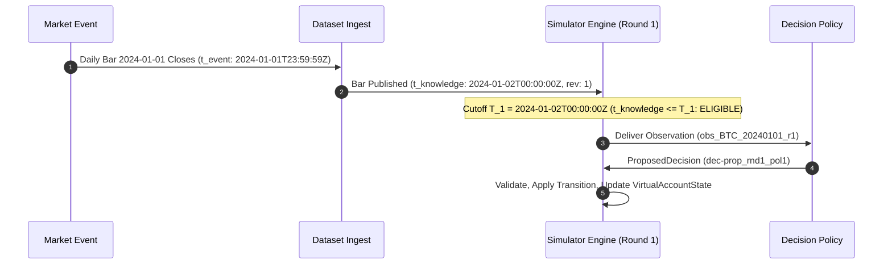
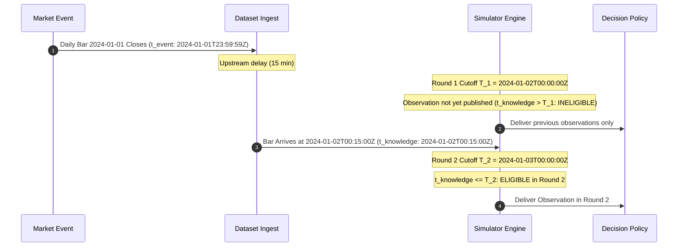
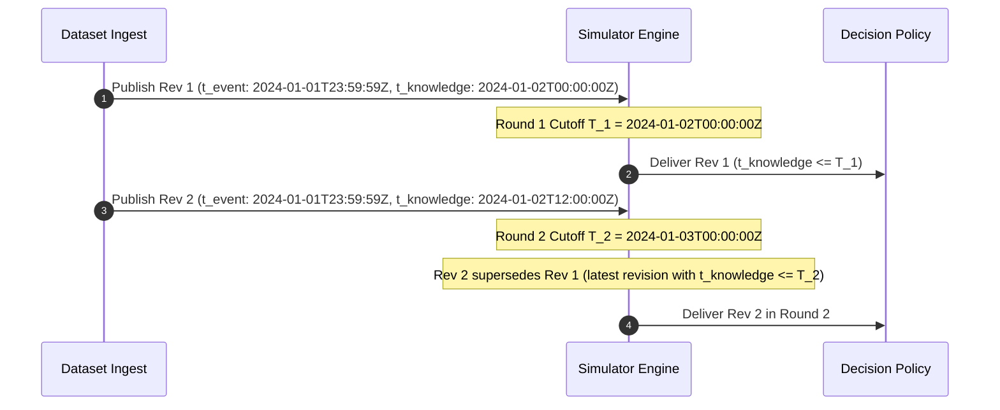

# Market Dataset Decision and Provenance Contract (v1)

## Document Status

- **Status:** Frozen Specification (Gate `DS-D0` / Work Unit `DS-02A`)
- **Authority:** Authoritative market data provenance, asset universe, and temporal normalization specification for `optees-decision-simulator`
- **Related Documents:**
  - [Core Contracts](core-contracts.md)
  - [Threat Model](threat-model.md)
  - [Benchmark Protocol](../BENCHMARK_PROTOCOL.md)
  - [Dataset Snapshot Schema](schemas/dataset_snapshot.v1.json)
  - [Canonical Manifest Example](examples/valid/market_dataset_manifest.v1.json)
  - [Market Dataset & Baseline Roadmap](../roadmaps/market-dataset-and-baseline-evidence.md)

---

## 1. Executive Summary & Objective

Work unit `DS-02A` freezes the first market dataset source and establishes the formal data provenance contract for the Optees Decision Simulator. This specification governs the extraction, temporal alignment, cryptographic integrity, and chronological partitioning of market time series before any normalization code, adapters, valuation functions, or baseline decision policies are executed.

### Core Principles
1. **Domain Isolation:** The core simulation kernel remains strictly domain-neutral. All market-specific conventions (tickers, daily klines, quote currencies) are compiled into generic `ObservationRecord` streams and `DatasetSnapshotManifest` entities.
2. **Zero Credentials:** The chosen source must be accessible without API keys, account registration, tokens, or ambient host secrets, guaranteeing reproducible, zero-friction headless testing and CI builds.
3. **No Retrospective Leakage:** Daily bars must have unambiguous event, publication, and knowledge timestamps. Retrospective backfill adjustments (e.g. split/dividend restatements) are rejected.
4. **Offline Replay Parity:** Simulations run 100% offline from local cached snapshots. Upstream network state cannot alter frozen execution hashes.

---

## 2. Candidate Source Evaluation and Selection Rationale

To ensure objective selection grounded in primary sources, four candidate data sources were systematically evaluated against the requirements of the Simulator:

| Evaluation Dimension | Candidate 1: Binance Public Data Archive (`data.binance.vision`) | Candidate 2: Yahoo Finance (Unofficial `yfinance` Scraping) | Candidate 3: Commercial REST APIs (Alpha Vantage, Polygon.io, Tiingo Free Tiers) | Candidate 4: Coinbase Exchange Public REST API (`/products/{id}/candles`) |
|---|---|---|---|---|
| **Primary URL & Provider** | Binance Public Historical Data Archive ([`data.binance.vision`](https://data.binance.vision/)) | Yahoo Finance ([`legal.yahoo.com/terms`](https://legal.yahoo.com/us/en/yahoo/terms/otos/index.html)) | Alpha Vantage ([`alphavantage.co/terms_of_service`](https://www.alphavantage.co/terms_of_service/)), Polygon.io ([`polygon.io/terms`](https://polygon.io/terms)) | Coinbase Cloud ([`docs.cloud.coinbase.com`](https://docs.cloud.coinbase.com/exchange/reference/exchangerestapi_getproductcandles)) |
| **Asset Class** | Cryptocurrency Spot (1d Klines) | US Equities / ETFs / Crypto | US Equities / Forex / Crypto | Cryptocurrency Spot (1d Candles) |
| **Authentication & Access** | **Zero credentials.** Direct unauthenticated HTTPS GET over AWS S3 / CloudFront. | Unofficial scraping; undocumented query endpoints; frequent IP bans. | **Mandatory API key.** Credentials passed via query params (`?apikey=...`). | **Zero credentials** for public market candles. |
| **License & Redistribution** | **Open public archive.** Terms permit open download, research, and redistribution with attribution. | **Strictly forbidden.** Yahoo ToS prohibits automated bulk extraction and redistribution. | **Redistribution prohibited** on free tiers; commercial license required. | Public read-only; no static pre-computed bulk checksum archive. |
| **Static Cryptographic Checksums** | **Official SHA-256 `.CHECKSUM` files** published alongside every daily/monthly zip file. | None. Dynamic web responses with no cryptographic integrity verification. | None. Dynamic JSON responses without published static checksum archives. | None. Responses generated on the fly per query range. |
| **Timestamp Semantics & Bar Precision** | Explicit millisecond UTC timestamps for bar start (`open_time`) and bar end (`close_time`). | Calendar date only; exact bar close and publication instant undefined. | Calendar date only (e.g. `2024-01-02`); exact bar finalization time undefined. | 86400s bucket start timestamps in Unix seconds. |
| **Calendar Regularity** | **24/7/365 continuous.** Zero exchange holidays, weekend market closures, or daylight saving shifts. | Irregular equity calendar (NYSE/NASDAQ holidays, weekend gaps, early closes). | Irregular equity calendar or forex market closure windows. | **24/7/365 continuous.** |
| **Retrospective Restatements** | **Zero restatements.** Historical spot trade aggregates are immutable facts. | **Severe leakage risk:** "Adjusted Close" retroactively alters historical price series. | Potential restatements on corporate actions and split adjustments. | Zero restatements for spot trade aggregates. |
| **Rate Limits & CI Viability** | Unbounded public cloud bandwidth; zero rate-limiting failures in CI. | Frequent HTTP 429 / HTTP 403 blocks and bot-detection challenges. | Severe rate limits (5 req/min, 25 req/day on Alpha Vantage); breaks headless CI. | Rate limited (10 req/s); requires paginated chunking (300 candles/call). |
| **Evaluation Verdict** | **SELECTED** | **REJECTED** | **REJECTED** | **REJECTED as Primary** |

### Detailed Rejection Rationale
1. **Yahoo Finance (`yfinance`):** Rejected due to legal prohibition on automated extraction/redistribution, undocumented endpoints subject to breakage, absence of cryptographic checksums, and the risk of temporal leakage caused by retrospective back-adjusted prices.
2. **Commercial REST Free Tiers (Alpha Vantage, Polygon.io, Tiingo):** Rejected because mandatory API keys violate the zero-credential requirement for open public replication. Furthermore, their terms of service explicitly prohibit committing or redistributing raw snapshot data, and their restrictive rate limits cause automated headless test suites to fail.
3. **Coinbase Exchange REST API:** While public and credential-free, Coinbase does not provide static pre-computed daily/monthly archive files with published SHA-256 checksums. Reconstructing multi-year series requires chunked pagination over dynamic REST endpoints, which introduces network nondeterminism compared to immutable static archives.

### Selection Decision
**Binance Public Historical Data Archive (`data.binance.vision`)** is selected as the authoritative initial market dataset for Phase `DS-02`.

---

## 3. Publisher and Retrieval Protocol

### 3.1 Upstream URLs and Archive Hierarchy
Binance publishes historical spot klines in standard CSV format packaged inside ZIP archives on `data.binance.vision`:

- **Daily Klines Pattern:**
  `https://data.binance.vision/data/spot/daily/klines/{SYMBOL}/1d/{SYMBOL}-1d-{YYYY-MM-DD}.zip`
- **Daily Checksum Pattern:**
  `https://data.binance.vision/data/spot/daily/klines/{SYMBOL}/1d/{SYMBOL}-1d-{YYYY-MM-DD}.zip.CHECKSUM`
- **Monthly Klines Pattern (Aggregated):**
  `https://data.binance.vision/data/spot/monthly/klines/{SYMBOL}/1d/{SYMBOL}-1d-{YYYY-MM}.zip`
- **Monthly Checksum Pattern:**
  `https://data.binance.vision/data/spot/monthly/klines/{SYMBOL}/1d/{SYMBOL}-1d-{YYYY-MM}.zip.CHECKSUM`

### 3.2 Raw CSV Structure (Primary Source Schema)
The unzipped raw CSV file contains 12 headerless columns for each 1d bar:

| Column Index | Field Name | Data Type | Description |
|---|---|---|---|
| `0` | `open_time` | integer (ms) | Start time of the 1d interval in Unix milliseconds UTC (e.g. `1704067200000` = `2024-01-01T00:00:00.000Z`) |
| `1` | `open` | decimal string | Opening price of the base asset in quote currency (`USDT`) |
| `2` | `high` | decimal string | Highest price reached during the 1d interval |
| `3` | `low` | decimal string | Lowest price reached during the 1d interval |
| `4` | `close` | decimal string | Closing price (final traded price) of the 1d interval |
| `5` | `volume` | decimal string | Total volume traded in base asset units (e.g. `BTC`) |
| `6` | `close_time` | integer (ms) | End time of the 1d interval in Unix milliseconds UTC (e.g. `1704153599999` = `2024-01-01T23:59:59.999Z`) |
| `7` | `quote_volume` | decimal string | Total turnover in quote currency (`USDT`) |
| `8` | `count` | integer | Total number of individual trades executed during the day |
| `9` | `taker_buy_volume` | decimal string | Volume of trades where the taker bought the base asset |
| `10` | `taker_buy_quote_volume` | decimal string | Turnover of trades where the taker bought the base asset in `USDT` |
| `11` | `ignore` | string | Unused upstream field (constant `"0"`) |

### 3.3 Zero Credentials & Download Limits
- All HTTP requests use standard unauthenticated `GET`.
- No request headers containing authorization, cookies, or tracking identifiers.
- Total raw download footprint for 4 assets over 2 years (2024–2025) is approximately 3.8 MB compressed.
- Ingestion and normalization must stream records sequentially to maintain an $O(1)$ memory footprint.

---

## 4. Legal License, Attribution, and Redistribution

- **License Terms:** Binance Public Data archive is openly provided for market research, academic study, algorithm development, and historical backtesting.
- **Attribution Requirement:** Any published benchmark or experiment report derived from this dataset must include the attribution:
  > *"Market data source: Binance Public Historical Data Archive (data.binance.vision)."*
- **Redistribution Policy:**
  - The repository stores canonical manifests (`dataset_snapshot.v1.json`) with cryptographic checksums and small synthetic test fixtures.
  - Large full-history binary raw archives and multi-megabyte normalized JSONL files are locally cached in the simulator's artifact/cache directory and fetched on demand with checksum verification, avoiding repo bloat while maintaining full provenance.

---

## 5. Asset Universe and Resource Identity Mapping

The initial multi-asset universe consists of 4 highly liquid cryptocurrency spot instruments quoted in Tether (`USDT`), with `USDT` serving as the common reference unit of account:

| Asset / Resource ID | Binance Pair | Series ID | Base Unit | Quote Unit | Initial Allocation ($q_{i,0}$) | Valuation Role |
|---|---|---|---|---|---|---|
| `USDT` | N/A (Reference) | N/A | `USDT` | `USDT` | `100,000.00` | Unallocated Reference Cash (Fixed Price 1.00) |
| `BTC` | `BTCUSDT` | `BTC_USDT_PRICE_1D` | `BTC` | `USDT` | `0.00000000` | High-liquidity core asset |
| `ETH` | `ETHUSDT` | `ETH_USDT_PRICE_1D` | `ETH` | `USDT` | `0.00000000` | High-liquidity core asset |
| `SOL` | `SOLUSDT` | `SOL_USDT_PRICE_1D` | `SOL` | `USDT` | `0.00000000` | High-volatility alternative asset |
| `BNB` | `BNBUSDT` | `BNB_USDT_PRICE_1D` | `BNB` | `USDT` | `0.00000000` | High-liquidity exchange ecosystem asset |

### Identifier Invariants
- `series_id`: Upper-case alphanumeric string with underscores (`^[A-Z0-9_]+$`).
- `resource_id`: Upper-case asset symbol matching the base asset (`BTC`, `ETH`, `SOL`, `BNB`, `USDT`).
- All account quantities $q_{i}$ are non-negative unless short positions are explicitly enabled by the episode definition.

---

## 6. Temporal Semantics and The Four Times

To guarantee scientific reproducibility and prevent lookahead bias, every market observation strictly distinguishes between the four canonical timestamps:

```
                      Day D Event Window [00:00:00Z -> 23:59:59Z]
                      ┌─────────────────────────────────────────┐
                      │   Trading occurs continuously           │
                      └─────────────────────────────────────────┘
                                                                │
                                              Bar Closes at Event Time (t_event = 23:59:59Z)
                                                                ▼
                                                        Publication / Aggregation Lag
                                                                │
                                                                ▼
                                              Bar Available at Knowledge Time (t_knowledge = 00:00:00Z on D+1)
                                                                │
                                                                ▼
   Round k Cutoff (T_k = 00:00:00Z on D+1) ─────────────────────┼───────────────────────────────►
                                                                │
                                                    Policy Executes (t_execution)
                                                                │
                                                    Decision Proposes Allocation
                                                                │
                                                    Outcome Evaluated & Applied (t_effective)
```

### 6.1 Formal Timestamp Mapping
For a 1d daily bar spanning day $D$:
- **Event Interval:** $[D\text{T00:00:00.000Z}, D\text{T23:59:59.999Z}]$ in UTC.
- **Event Time ($t_{event}$):** The moment the trading activity of the bar was finalized:
  $$t_{event} = D\text{T23:59:59Z}$$
- **Knowledge Time ($t_{knowledge}$):** The earliest timestamp at which the finalized bar was aggregated and made available to decision policies without lookahead:
  $$t_{knowledge} = (D+1)\text{T00:00:00Z}$$
- **Execution Time ($t_{execution}$):** The timestamp when the policy execution begins for Round $k$ where cutoff $T_k = (D+1)\text{T00:00:00Z}$.
- **Effective Time ($t_{effective}$):** The timestamp when the accepted `TransitionRecord` updates the `VirtualAccountState`.

### 6.2 Explicit Observation Timelines

#### Timeline A: Normal Observation
The daily bar for 2024-01-01 closes at 23:59:59Z. It is available at knowledge time `2024-01-02T00:00:00Z`. Round 1 evaluates at cutoff $T_1 = \text{2024-01-02T00:00:00Z}$.
- $t_{event} = \text{2024-01-01T23:59:59Z}$
- $t_{knowledge} = \text{2024-01-02T00:00:00Z} \le T_1 \implies$ **Eligible in Round 1.**



#### Timeline B: Delayed Observation (Lagged Publisher Feed)
Upstream feed experiences a 15-minute aggregation delay. The bar for 2024-01-01 is published at `2024-01-02T00:15:00Z`.
- $t_{event} = \text{2024-01-01T23:59:59Z}$
- $t_{knowledge} = \text{2024-01-02T00:15:00Z} > T_1 \implies$ **Ineligible in Round 1.**
- In Round 2 ($T_2 = \text{2024-01-03T00:00:00Z}$), $t_{knowledge} \le T_2 \implies$ **Eligible in Round 2.**



#### Timeline C: Corrected Observation (Upstream Revision)
Publisher publishes initial provisional bar (Revision 1) at `2024-01-02T00:00:00Z`. At `2024-01-02T12:00:00Z`, publisher publishes a restatement/correction (Revision 2) due to dropped trades.
- At Round 1 ($T_1 = \text{2024-01-02T00:00:00Z}$): Only Revision 1 is known ($t_{knowledge} \le T_1$). Revision 1 is delivered.
- At Round 2 ($T_2 = \text{2024-01-03T00:00:00Z}$): Both Revision 1 and Revision 2 have $t_{knowledge} \le T_2$. The `EligibilityService` supersedes Revision 1 with Revision 2. Revision 2 is delivered.



---

## 7. Calendar and Market Conventions

- **Continuous 24/7/365 Schedule:** Cryptocurrency markets trade continuously. Every calendar day $D$ produces exactly one 1d observation bar per active asset series.
- **No Weekend Gaps / Holiday Closures:** Eliminates calendar irregularities and holiday interpolation for the v1 market baseline.
- **Round Scheduling:**
  - Round $k$ decision cutoff occurs at $T_k = \text{YYYY-MM-DD}T00:00:00Z$.
  - Interval between rounds: $\Delta T = 86,400\text{ seconds}$ (1 standard calendar day).

---

## 8. Observation Payload Schema and Numerical Conventions

Every `ObservationRecord` emitted by the normalized market dataset conforms to [`schemas/observation.v1.json`](schemas/observation.v1.json):

```json
{
  "$type": "observation",
  "schema_version": "1.0.0",
  "observation_id": "obs_BTC_20240101_r1",
  "snapshot_id": "ds-snap_binance_spot_1d_v1",
  "series_id": "BTC_USDT_PRICE_1D",
  "event_time": "2024-01-01T23:59:59Z",
  "knowledge_time": "2024-01-02T00:00:00Z",
  "revision": 1,
  "payload": {
    "open": "42283.50",
    "high": "44180.00",
    "low": "42180.20",
    "close": "43680.10",
    "volume": "38450.12500000",
    "quote_volume": "1665241080.50",
    "trade_count": 1245080,
    "taker_buy_base_volume": "19420.05000000",
    "taker_buy_quote_volume": "841289300.25"
  }
}
```

### 8.1 Numerical Rules
1. **Decimal Precision:** All financial prices and asset quantities are encoded as exact decimal strings matching `^-?\d+(\.\d+)?$`. No binary floating-point numbers in financial payloads.
2. **Authoritative Valuation Price:** The `close` field of the eligible daily observation is the official valuation price for calculating virtual account net equity $V_t$ and executing round transition rebalancing.
3. **Finite Positive Values:** Prices and traded volumes must be strictly finite positive decimals.

---

## 9. Missing Data, Staleness, Duplicates, and Delistings

1. **Missing Observation Policy:** If an asset bar is absent on day $D$, no synthetic observation is hallucinated or forward-filled into the dataset stream. The `EvaluatorService` and valuation adapters value existing holdings at the last known accepted price, recording an explicit staleness flag (`price_stale: true`) in metric records.
2. **Duplicate Identity Rejection:** The dataset ingestion parser rejects duplicate `(series_id, event_time, revision)` keys with a fatal `DuplicateIdentityError`.
3. **Asset Delisting / Trading Halts:** If an asset ceases trading, its series terminates at the final published bar. Held balances remain frozen at the last traded valuation until explicit liquidation or write-down policies apply.

---

## 10. Three-Tier Cryptographic Provenance

To guarantee end-to-end auditability from raw provider files to simulation evaluation, the dataset architecture implements three distinct cryptographic hash boundaries:

```
  ┌────────────────────────────────────────────────────────┐
  │ 1. Raw Upstream Archive (ZIP / CSV)                    │
  │    SHA-256 Checksum: raw_artifact_hash                 │
  └───────────────────────────┬────────────────────────────┘
                              │ Parse & Canonical Normalize
                              ▼
  ┌────────────────────────────────────────────────────────┐
  │ 2. Normalized JSONL Snapshot File                      │
  │    SHA-256 Checksum: checksum_sha256 in Manifest       │
  └───────────────────────────┬────────────────────────────┘
                              │ Generate Dataset Manifest
                              ▼
  ┌────────────────────────────────────────────────────────┐
  │ 3. DatasetSnapshotManifest Record                      │
  │    RFC 8785 Canonical JSON SHA-256: manifest_hash       │
  └────────────────────────────────────────────────────────┘
```

1. **`raw_artifact_hash`:** The SHA-256 hash computed over the raw downloaded `.zip` archive matching the upstream publisher's `.CHECKSUM` file.
2. **`normalized_snapshot_hash` (`checksum_sha256`):** The SHA-256 hash computed over the canonical normalized JSONL stream of `ObservationRecord` lines.
3. **`manifest_hash`:** The SHA-256 hash computed over the RFC 8785 canonical JSON representation of the `DatasetSnapshotManifest` entity.

Any discrepancy between these tiers halts execution with a `ChecksumMismatchError`.

---

## 11. Chronological Period Partitioning (Anti-Snooping Standard)

To prevent data leakage, retrospective bias, and hyperparameter overfitting, the market dataset is divided into four strictly chronological, non-overlapping evaluation partitions:

| Period Partition | Interval Start (UTC) | Interval End (UTC) | Duration | Permitted Usage | Optimization & Tuning Rules |
|---|---|---|---|---|---|
| **Exploratory (P0)** | `2024-01-01T00:00:00Z` | `2024-06-30T23:59:59Z` | 182 days | Exploratory data analysis, pipeline sanity checks, baseline calibration | Model architecture exploration permitted |
| **Calibration (P1)** | `2024-07-01T00:00:00Z` | `2024-12-31T23:59:59Z` | 184 days | Formal parameter estimation, covariance matrix calibration, hyperparameter freezing | Parameters frozen at end of P1; no further tuning allowed |
| **Private Evaluation (P2)** | `2025-01-01T00:00:00Z` | `2025-06-30T23:59:59Z` | 181 days | Official benchmark evaluation across all competing policies | **Strictly ZERO tuning, parameter adjustment, or code redesign** |
| **Forward Stress (P3)** | `2025-07-01T00:00:00Z` | `2025-12-31T23:59:59Z` | 184 days | Out-of-sample forward stress testing across market regime changes | Pinned execution of frozen policy versions |

### Anti-Snooping Invariant
**Under no circumstances may period boundaries, asset choices, or hyperparameters be adjusted after observing policy returns on P2 or P3.** All hypotheses and parameter choices must be recorded and frozen in the episode definition prior to execution.

---

## 12. Offline Replay, Cache Behavior, and Source-Unavailable Semantics

1. **Local Snapshot Cache:** When a snapshot is normalized, it is stored in the local cache directory (`~/.cache/optees-simulator/datasets/` or repository artifacts directory).
2. **Offline Replay Guarantee:** If no network connection is available, the simulator executes solely against the local snapshot.
3. **Source Unavailable Behavior:**
   - If a requested snapshot is absent from local cache and network retrieval fails (or is disabled), the runner terminates immediately with a structured `ResourceNotFoundError`.
   - If a downloaded raw archive fails checksum validation against the publisher's checksum, retrieval is aborted with `ChecksumMismatchError`.
   - The engine never silently falls back to unverified synthetic data when a real snapshot is requested.
