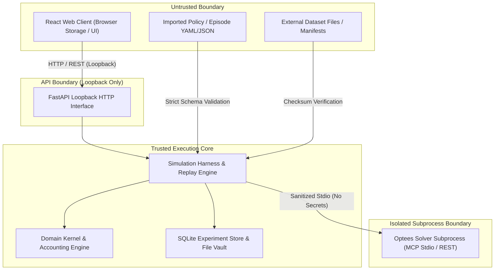

# Optees Decision Simulator Threat Model

## Document Status

- **Status:** Frozen (Version 1.0.0)
- **Work Unit:** `DS-00`
- **Gate:** `DS-C`
- **Authority:** Authoritative security and threat analysis for `optees-decision-simulator`
- **Related Documents:**
  - [Core Contracts](core-contracts.md)
  - [Architecture Reference](../ARCHITECTURE.md)
  - [Optees Integration](../OPTEES_INTEGRATION.md)

---

## 1. System Overview and Trust Boundaries

The Optees Decision Simulator is a local-first experimental application designed to execute and compare decision policies. To protect host system integrity, prevent scientific invalidation (such as data leakage), and eliminate accidental financial side effects, the system defines six explicit trust boundaries.

### Trust Boundary Definitions

1. **Boundary A: User / Web Presentation (Untrusted):**
   The browser runs client-side JavaScript. It cannot be trusted to compute official scores, enforce time constraints, hold solver credentials, or bypass validation.
2. **Boundary B: Application Loopback API (Guarded):**
   FastAPI endpoints bound strictly to loopback (`127.0.0.1`). Validates all incoming payloads against schemas before passing commands to application services.
3. **Boundary C: Trusted Simulation Core (Trusted):**
   The Python application layer, domain kernel, virtual accounting engine, and SQLite persistence. Owns the deterministic clock, enforces knowledge cutoffs, and maintains cryptographic hashes.
4. **Boundary D: Storage Layer (Guarded):**
   Local filesystem and SQLite database. Subject to strict file path containment within designated workspace directories.
5. **Boundary E: Optees Subprocess (Isolated):**
   A child process running `optees-mcp` or a loopback REST daemon. Receives sanitized problem payloads with no ambient host credentials.
6. **Boundary F: External Datasets and Imports (Untrusted):**
   Third-party time series files, imported episode definitions, and policy packages. Treated as untrusted inputs requiring checksum validation and structural checks.

---

## 2. Core Assets to Protect

1. **Temporal Truth & Anti-Leakage:** Ensuring no policy observes data ahead of its knowledge time ($t_{knowledge} \le T_k$).
2. **Policy Isolation:** Ensuring competing policies execute in strict isolation without cross-contamination.
3. **Accounting Integrity:** Preventing unauthorized resource creation, unrecorded transfers, or unconstrained leverage.
4. **Reproducibility Provenance:** Ensuring all records, solver calls, receipts, and hashes are immutable and tamper-evident.
5. **Host Security & Secret Protection:** Preventing arbitrary code execution, path traversal, process exhaustion, and credential leakage.
6. **Paper-Only Safety Boundary:** Ensuring the simulator never connects to live brokerage endpoints or executes financial transactions.

---

## 3. Threat Analysis and Mitigations

### Threat Vector 1: Temporal Leakage & Incorrect Knowledge Cutoffs
- **Description:** A policy accesses future observations (where $t_{event} > T_k$ or $t_{knowledge} > T_k$), invalidating the benchmark and producing artificially inflated performance.
- **Attack / Failure Mode:** Dataset adapter exposes lookahead data; policy queries unmasked time series; timezone confusion shifts cutoff horizons.
- **Mitigation:**
  - The simulator harness acts as a strict firewall: `DatasetPort.get_observations_as_of(cutoff)` filters all records by $t_{knowledge} \le T_k(r)$.
  - All timestamps are enforced in UTC RFC 3339 format with strict schema validation.
  - Runtime assertions verify $t_{knowledge}(o) \le T_k(r)$ on every consumed record; violations trigger an immediate unrecoverable `TemporalLeakageError`.
- **Residual Risk:** Upstream errors in dataset timestamps (e.g. incorrect publisher knowledge timestamps). Mitigated by auditing dataset manifests and documenting revisions.

### Threat Vector 2: Cross-Policy State Contamination
- **Description:** A policy inspects or mutates the internal state, proposals, or virtual accounts of a competitor.
- **Attack / Failure Mode:** Shared mutable state in Python runtime; policy A emits an action referencing policy B's account.
- **Mitigation:**
  - Virtual account state is immutable and indexed strictly by `policy_id`.
  - Proposals from policy $P_i$ can only specify transitions for account $A_i$. Any action referencing an external account is rejected with `CROSS_POLICY_ACCOUNT_CONTAMINATION`.
  - Policies are executed sequentially or in isolated execution contexts with deep-copied observation inputs.
- **Residual Risk:** Low; strictly enforced by domain kernel invariants.

### Threat Vector 3: Mutation of Frozen Definitions After Start
- **Description:** An operator or policy attempts to alter hyperparameters, rule sets, or initial balances of an episode after execution has started.
- **Attack / Failure Mode:** In-place update of SQLite `episode_definition` rows; dynamic tuning of policy parameters based on observed performance.
- **Mitigation:**
  - `EpisodeDefinition` and `PolicyVersion` are hashed at creation and permanently frozen upon transition to `RUNNING`.
  - Round records link back to `episode_definition_hash` and `policy_hash`.
  - Database schema enforces append-only semantics for execution records; updates to frozen tables are prohibited.
- **Residual Risk:** Manual tampering with local SQLite database file on disk. Mitigated by cryptographic Merkle chain verification during replay.

### Threat Vector 4: Malformed, Oversized, Duplicated, or Out-of-Order Observations
- **Description:** Feeding corrupt, extremely large, or duplicated observation records to cause crashes or non-deterministic behavior.
- **Attack / Failure Mode:** Integer overflow; malformed float strings; duplicate observation IDs; out-of-order event delivery.
- **Mitigation:**
  - Strict JSON Schema validation on all `observation.v1.json` payloads.
  - Number representation must be strictly finite; `NaN`, `Infinity`, and `-Infinity` are rejected.
  - Observations are sorted by the deterministic 5-tuple: $(t_{knowledge}, t_{event}, \text{series\_id}, \text{revision}, \text{observation\_id})$.
  - Duplicate observation IDs trigger rejection during snapshot ingestion.
- **Residual Risk:** None; handled deterministically by schema validation and sorting.

### Threat Vector 5: Hash Ambiguity & Canonicalization Mismatch
- **Description:** Different runtimes (Python vs TypeScript vs CLI) compute different hashes for semantically identical objects due to key ordering, float formatting, or whitespace.
- **Attack / Failure Mode:** Replay fails spuriously across platforms; verification tools reject valid runs.
- **Mitigation:**
  - Universal adoption of **RFC 8785 (JSON Canonicalization Scheme - JCS)**.
  - Unicode strings are preserved exactly as required by RFC 8785; lone
    surrogate code points are rejected instead of being normalized.
  - Exact quantities are encoded as decimal strings (e.g. `"100.50"`) to avoid floating-point engine discrepancies.
  - SHA-256 is computed strictly over the UTF-8 bytes of the RFC 8785 canonical string.
- **Residual Risk:** Low but non-zero. A non-conforming runtime implementation,
  especially around binary64 formatting or Unicode handling, can still produce
  divergent hashes; golden vectors and Python/JavaScript conformance tests are
  required before runtime hashing ships.

### Threat Vector 6: Path Traversal & Untrusted Imported Episode Files
- **Description:** An imported episode file or dataset manifest contains relative or absolute file paths attempting to read or write arbitrary host files (e.g., `../../etc/passwd`).
- **Attack / Failure Mode:** Path traversal via `source_uri` or dataset import commands.
- **Mitigation:**
  - All dataset and file imports are validated against an explicit whitelist of allowed root directories (`data/snapshots/`, `workspace/`).
  - Absolute paths outside workspace roots and relative paths with `..` segments are strictly rejected before opening any file descriptor.
- **Residual Risk:** Low; guarded by path normalization and sandbox root checks.

### Threat Vector 7: Arbitrary Code Execution in Imported Policies / Workflows
- **Description:** An imported policy or workflow definition executes untrusted arbitrary code (e.g., `eval()`, `exec()`, `os.system()`, `pickle.loads()`).
- **Attack / Failure Mode:** Remote code execution via maliciously crafted policy definitions or serialized pickles.
- **Mitigation:**
  - Policy definitions in v1 are purely declarative (`policy_version.v1.json`). They declare hyperparameters, required capabilities, and entrypoint references.
  - Deserialization is performed strictly via safe JSON parsers; `pickle`, `yaml.unsafe_load`, and dynamic `eval()` are forbidden across the codebase.
  - Policies must be registered as statically known Python classes inside the approved codebase namespace.
- **Residual Risk:** Custom policy classes written by local users. Users run within their local user context.

### Threat Vector 8: Optees Subprocess Failure, Timeout, & Restart Ambiguity
- **Description:** The Optees MCP child process crashes, hangs, returns late results, or produces non-deterministic timeouts during optimization.
- **Attack / Failure Mode:** Simulator hangs indefinitely waiting for a solve; crash leaves harness in undefined state.
- **Mitigation:**
  - Bounded execution timeouts on all Optees invocations (`timeout_seconds`).
  - If a solve times out or the process exits abnormally, the call is recorded as `TIMEOUT` or `FAILED` in an immutable `OpteesCallReceipt`.
  - The simulator applies the frozen `failure_policy` (`FALLBACK_TO_HOLD` or `CANCEL_EPISODE`) without guessing or fabricating results.
  - Process restarts occur only between discrete rounds and re-verify capability descriptors.
- **Residual Risk:** Solver non-determinism across different CPU microarchitectures. Mitigated by `NUMERICAL_EPSILON_DEVIATION` replay reporting.

### Threat Vector 9: Credential, Token, & Environment Secret Leakage
- **Description:** Sensitive host environment variables, REST bearer tokens, or user credentials leak into simulation logs, receipts, or export bundles.
- **Attack / Failure Mode:** Full process `env` logged into `OpteesCallReceipt`; error traces exposing host paths and keys; bearer tokens sent to React frontend.
- **Mitigation:**
  - Optees child processes receive a stripped, minimal environment allowlist.
  - All transport receipts are sanitized; `redacted_transport_metadata` records boolean confirmation `transport_sanitized: true` without storing env vars.
  - The React frontend communicates only with the local simulator API and never handles external tokens.
  - Export bundles and logs are scanned for token-like patterns.
- **Residual Risk:** Low; automated test suite verifies secret redaction across all example payloads.

### Threat Vector 10: Resource Exhaustion (DoS)
- **Description:** Extremely large episodes, infinite round calendars, massive observation streams, or unbounded payload sizes exhaust system memory, disk, or CPU.
- **Attack / Failure Mode:** Out-Of-Memory (OOM) crashes; disk fill via unbounded artifact generation.
- **Mitigation:**
  - Configurable limits: `max_rounds_per_episode` (default: 10,000), `max_policies_per_episode` (default: 20), `max_payload_bytes` (default: 10 MB).
  - Streamed JSONL processing for large dataset snapshots rather than loading entire datasets into memory.
  - Bounded retention on subprocess stderr logs (e.g., last 100 KB).
- **Residual Risk:** Massive datasets exceeding local disk space. Managed by pre-flight storage capacity checks.

### Threat Vector 11: Report / Markdown Injection & Unsafe Links
- **Description:** Malicious strings embedded in policy descriptions or observation payloads inject raw HTML/JavaScript or misleading external links in generated Markdown reports or web views.
- **Attack / Failure Mode:** Cross-Site Scripting (XSS) in React UI; misleading phishing links in published benchmark reports.
- **Mitigation:**
  - All user-supplied text fields (titles, descriptions, rationale) are treated as plain text and sanitized.
  - Markdown renderers in web UI must disable raw HTML parsing (`rehype-raw` disabled or sanitized via DOMPurify).
  - External links are constrained to approved documentation domains or rendered with `rel="noopener noreferrer"`.
- **Residual Risk:** Minimal; presentation layer sanitization.

### Threat Vector 12: Accidental Real-World Side Effects & Financial Connectors
- **Description:** Accidental execution of real-world orders or transactions due to misunderstood configuration or rogue code.
- **Attack / Failure Mode:** Brokerage API credentials loaded by mistake; order placement code linked into harness.
- **Mitigation:**
  - The simulator is strictly **paper-only**: no brokerage SDKs, exchange connectors, or wallet signing libraries exist in the repository dependencies.
  - `virtual_account_state` and `transition_record` exist solely in the local simulator database.
  - Architecture explicitly forbids adding order-execution adapters.
- **Residual Risk:** Low while the architectural prohibition and dependency checks remain enforced.

### Threat Vector 13: Lookahead via Incomplete Daily Bar Leakage
- **Description:** A decision policy consumes a completed daily bar before its conservatively assigned availability time, or executes at the already-known closing price.
- **Attack / Failure Mode:** Dataset parsing backdates knowledge or conflates the valuation mark with a transaction execution price.
- **Mitigation:**
  - The provenance contract preserves exact upstream close time and assigns historical `knowledge_time = (D+2)T00:00:00Z` unless a verifiable first-observed instant exists.
  - The existing eligibility service enforces `knowledge_time <= cutoff`; `DS-02D` must separately freeze post-decision execution pricing.
- **Residual Risk:** Medium until the market normalizer and execution-price contract are implemented and tested; low thereafter, never zero.

### Threat Vector 14: Upstream Restatement & Silent Historical Rewrites
- **Description:** An upstream market data provider restates, adjusts, or silently rewrites historical observations without updating timestamps or revision counters, invalidating previously recorded episode hashes.
- **Attack / Failure Mode:** Unofficial scrapers (e.g. Yahoo Finance) rewrite past series with split/dividend adjustments; dynamic REST responses drift over time.
- **Mitigation:**
  - Each acquisition is immutable even when the publisher replaces an archive, with three-tier SHA-256 boundaries (`raw_artifact_hash`, `normalized_snapshot_hash`, `manifest_hash`).
  - Restatements must be explicitly modeled with incremented `revision` numbers and updated `knowledge_time`.
  - Replay verification asserts bit-for-bit snapshot hash equality; any silent upstream change is immediately flagged as a hash divergence.
- **Residual Risk:** Low; guarded by static snapshot manifests and checksum assertions.

### Threat Vector 15: Upstream Provider Outage & Unpinned Live Ingest
- **Description:** Simulator runs depend on active network connectivity to upstream providers, leading to flaky benchmarks, rate-limiting errors, or provider deprecation.
- **Attack / Failure Mode:** Network timeout during simulation run; API endpoint returns 429 Too Many Requests; upstream provider discontinues endpoint.
- **Mitigation:**
  - Simulation runs are strictly decoupled from live network ingest.
  - The simulator operates 100% offline against pre-fetched, locally cached, checksum-verified snapshot artifacts.
  - If a snapshot file is missing or corrupted, the run fails immediately with a deterministic `ResourceNotFoundError` or `ChecksumMismatchError` rather than making dynamic unpinned HTTP calls.
- **Residual Risk:** Medium until the `DS-02C` cache and acquisition adapter exist; low for accepted offline snapshots thereafter.

---

## 4. Residual Risk Matrix

| Threat Category | Severity | Likelihood | Mitigation Quality | Residual Risk Level |
|---|---|---|---|---|
| Temporal Leakage | Critical | Medium | High (Schema, UTC, Cutoff Firewall) | Low |
| Cross-Policy Contamination | High | Low | High (Account Isolation, Domain Kernel) | Very Low |
| Record Tampering | High | Low | High (RFC 8785, SHA-256 Merkle Chain) | Very Low |
| Arbitrary Code Execution | Critical | Low | High (Declarative Schemas, Safe Deserialization)| Low |
| Secret Leakage | High | Low | High (Environment Scrubbing, Redaction) | Very Low |
| Solver Timeout / Crash | Medium | Medium | High (Receipts, Frozen Fallback Policies) | Low |
| Resource Exhaustion | Medium | Low | High (Hard Caps, Streamed Ingestion) | Low |
| Accidental Live Orders | Critical | Zero | Absolute (No Brokerage Connectors) | Zero |
| Lookahead Bar Leakage | Critical | Medium | Partial until DS-02D (conservative knowledge cutoff plus future execution-price contract) | Medium |
| Silent Upstream Rewrites | High | Low | High (Three-Tier Checksum Boundaries) | Very Low |
| Upstream Outage Drift | Medium | Low | High (Offline Local Snapshot Cache) | Very Low |

---

## 5. Security Invariants for Gate DS-C / DS-D0

1. **No External Network Calls:** The domain core, contract validation tools, and simulation replay execute completely offline.
2. **Deterministic Hashing:** Given identical semantic data, canonical serialization and SHA-256 hashing produce the exact same byte string across all platforms.
3. **Strict Validation:** Any payload failing schema constraints or violating temporal cutoffs must be rejected immediately with explicit error diagnostics.
4. **Three-Tier Checksum Integrity:** Ingested datasets must match their raw artifact, normalized snapshot, and manifest SHA-256 hashes before entering the simulation harness.
